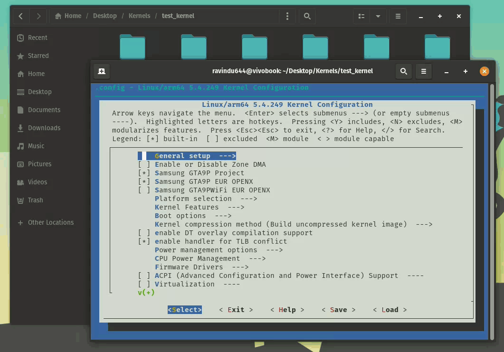

## A Beginner-Friendly Guide to Compile Your First Android Kernel!

**What You'll Learn:**  

- Understanding the kernel root & choosing the right compilers for compilation
- Customizing the kernel and applying kernel patches.
- Remove Samsung's anti-root protections.  
- Implementing KernelSU (to-do)
- Creating a signed boot image from the compiled kernel

**Requirements:**
- A working 🧠
- Ubuntu/Debian based PC/Server
- Knowledge of basic commands in Linux, and Bash script knowledge
- Patience
	
### 🛠 Install the dependencies for compiling kernels
- Only works on Debian-based distros.
- Paste the code below in your terminal to start installation:
 
```bash
sudo apt update && sudo apt install -y git device-tree-compiler lz4 xz-utils zlib1g-dev openjdk-17-jdk gcc g++ python3 python-is-python3 p7zip-full android-sdk-libsparse-utils erofs-utils \
default-jdk git gnupg flex bison gperf build-essential zip curl libc6-dev libncurses-dev libx11-dev libreadline-dev libgl1 libgl1-mesa-dev \
python3 make sudo gcc g++ bc grep tofrodos python3-markdown libxml2-utils xsltproc zlib1g-dev python-is-python3 libc6-dev libtinfo6 \
make repo cpio kmod openssl libelf-dev pahole libssl-dev libarchive-tools zstd --fix-missing && wget http://security.ubuntu.com/ubuntu/pool/universe/n/ncurses/libtinfo5_6.3-2ubuntu0.1_amd64.deb && sudo dpkg -i libtinfo5_6.3-2ubuntu0.1_amd64.deb
```
<br>❗The video Guide for this tutorial can be found here (outdated): Open in <a href="https://t.me/SamsungTweaks/137">Telegram</a> </h3>
<br>

### Quick Links :
01. 📁 [Downloading the kernel source code for your device](https://github.com/ravindu644/Android-Kernel-Tutorials#--downloading-the-kernel-source-code-for-your-device)
02. 🧠 [Understanding the Kernel root](https://github.com/ravindu644/Android-Kernel-Tutorials?tab=readme-ov-file#-understanding-the-kernel-root)
03. 🧠 [Understanding non-GKI & GKI kernels](https://github.com/ravindu644/Android-Kernel-Tutorials#-understanding-non-gki--gki-kernels)
04. 👀 [Preparing for the Compilation](https://github.com/ravindu644/Android-Kernel-Tutorials#--preparing-for-the-compilation)
05. ⚙️ [Customizing the Kernel (Temporary Method)](https://github.com/ravindu644/Android-Kernel-Tutorials#-customizing-the-kernel-temporary-method)
06. ⚙️ [Customizing the Kernel (Permanent Method)](https://github.com/ravindu644/Android-Kernel-Tutorials#-customizing-the-kernel-permanent-method)
07. ✅ [Compiling the Kernel](https://github.com/ravindu644/Android-Kernel-Tutorials#-compiling-the-kernel)
08. 🟥 [Fixing the Known compiling issues](https://github.com/ravindu644/Android-Kernel-Tutorials#-fixing-the-known-compiling-issues)
09. 🟡 [Building a Signed Boot Image from the Compiled Kernel](https://github.com/ravindu644/Android-Kernel-Tutorials#-building-a-signed-boot-image-from-the-compiled-kernel)

<hr>
<h2> ✅ Downloading the kernel source code for your device</h2>

- **⚠️ If your device is Samsung,**

#### 01. Download the kernel source from here: [Samsung Opensource]( https://opensource.samsung.com/main)


#### 02. Extract the ```Kernel.tar.gz``` from the source zip, unarchive it using this command and please do not use any apps to do this:

```bash
tar -xvf Kernel.tar.gz && rm Kernel.tar.gz
```


**Note:** It's a good idea to give the entire kernel directory 755 permission to remove those read-only error from files and folders. This prevents issues when editing files and upstreaming the kernel.

**Run this command to fix it:**

```
chmod +755 -R /path/to/extracted/kernel/
```

**Before:**


**After:**


**The following video demonstrates all the steps mentioned above:** 

[🎥 Extracting Samsung's Kernel.tar.gz & granting required permissions](https://www.youtube.com/watch?v=QLymPkTpC2Y)

<hr>

- **⚠️ For other devices,** You can find them by your OEM's sites or from your OEM's **official** GitHub repos:

  

## ✅ Understanding `non-GKI` & `GKI kernels`
```
+--------------------------------------------------+
|          Android LTS Kernel Versions             |
+--------------------------------------------------+
|       non-GKI       |     GKI 1.0    |  GKI 2.0  |
+---------------------+----------------+-----------+
|         3.10        |       5.4      |   5.10    |
|         3.18        |                |   5.15    |
|         4.4         |                |   6.1     |
|         4.9         |                |   6.6     |
|         4.14        |                |           |
|         4.19        |                |           |
+---------------------+----------------+-----------+
```
#### Explanation:

1. **non-GKI**:
   - Includes older and heavily customized kernels used in Android devices before the GKI initiative.
   - Versions like **3.10**, **3.18**, **4.4**, **4.9**, **4.14**, and **4.19** are the most common (LTS Kernels).
   - These kernels are **device-specific** and often modified by OEMs (eg: Samsung).
   - These kernels are deprecated in Android Common Kernel repository.

2. **GKI 1.0**:
   - Google's first iteration of the Generic Kernel Image, starts from kernel version **5.4**.
   - **Note:** Some people say that **4.19** is also considered a **GKI 1.0** kernel, as it was used as a transitional kernel in early GKI implementations. But it didn't clear, and more context needed.
   - A few variants exist for certain SoC, like qGKI (Qualcomm GKI), and mGKI (Mediatek GKI), and was included with some features from that SoC.

3. **GKI 2.0**:
   - Google's second iteration of the Generic Kernel Image, starting with kernel version **5.10**.
   - Includes newer LTS kernel like **6.6**.

---

### Notes:
- **LTS = Long-Term Support**: These kernels are stable, well-maintained, and receive long-term updates.
- **GKI = Generic Kernel Image**: A unified kernel framework introduced by Google to standardize the kernel across Android devices.

## ✅ Understanding the ```Kernel root```


- As you can see in the above screenshot, it's the Linux kernel source code.
- It must have those folders, **highlighted in blue in the terminal.**
- **In GKI kernels,** the kernel root is located in a folder named "common".

- If you have a **GKI Samsung kernel**, you should use the "common" kernel instead of "msm-kernel" for the compilation.

<h2> ✅ Preparing for the Compilation</h2>

### 01. After downloading or cloning the Kernel Source, we should have a build script to compile our kernel.

- Before creating a build script, we must determine the compatible compilers we will use to build our kernel.

- Run ```make kernelversion``` inside the kernel root to check your kernel version.


- In my case, the kernel version is **5.4,** with qualcomm chipset, which is [qGKI](https://github.com/ravindu644/Android-Kernel-Tutorials#-understanding-non-gki--gki-kernels).

- You can find full information about **choosing the correct compiler for your kernel version** [here](./toolchains/) (based on my experience, btw).

- Keep in mind that **you don't need to manually download any of these toolchains** since my build scripts handle everything for you :)  

- Next, go to [build_scripts](./build_scripts/), choose the appropriate script, download it, and place it inside your kernel's root directory.


<hr>

### 02. Edit the Build script:

**💡 Better to Know:** A **defconfig** (default configuration) is like a preset settings file for the kernel.

- It tells the build system which features to enable or disable.

**So, Open the build script in a text editor and make these changes:**

- Replace `your_defconfig` to your current defconfig which is located in `arch/arm64/configs`

- In GKI 2.0 kernels, it's normally `gki_defconfig`

- But just in case, make sure to check `arch/arm64/configs` or `arch/arm64/configs/vendor`

- If your defconfig is located in the `arch/arm64/configs` directory, just replace `your_defconfig` with the name of your defconfig.

- If your defconfig is located in the `arch/arm64/configs/vendor` directory, replace `your_defconfig` like this:
  
  - `vendor/name_of_the_defconfig`
  - Example patch: [here](./patches/005.edit-defconfig.patch)

  

**❗If your device is Samsung Exynos, it doesn't support compiling the kernel in a separated 'out' directory. So, [edit your build script like this](./patches/001.nuke_out.patch)**  

---
#### ⚠️ [IMPORTANT] : *If your device is Samsung, it usually uses some device-specific variables in "some" kernels.*

- **As an example,** in the Galaxy S23 FE kernel source code, we can see they used variables called `TARGET_SOC=s5e9925`, `PLATFORM_VERSION=12`, and `ANDROID_MAJOR_VERSION=s`

- **If we didn't export those variables correctly,** the kernel failed to build in my case.

- Don't worry, they usually mention these required variables in their `README_Kernel.txt` or their own `build_kernel.sh`

  

**Refer to this example patch to properly integrate such variables into our build script:** [here](./patches/007.Define-OEM-Variables.patch)

**Note:** Just don't overthink it, even if they use values like 12 and S for Platform and Android versions, even if you have a higher Android version.

---

### 03. Edit the Makefile.

- If you find these variables: ```REAL_CC``` or ```CFP_CC``` in your "Makefile", remove them from the "Makefile", then Search for "wrapper" in your Makefile. If there's a line related to a Python file, remove that entire line/function as well.

    - Example patch of removing the wrapper: [click here](./patches/004.remove_gcc%20wrapper.patch)

<hr>

### 04. Now, grant executable permissions to ```build_xxxx.sh``` using this command.
  ```
  chmod +x build_xxxx.sh
  ```
### 05. Finally, run the build script using this command :
  ```
./build_xxxx.sh
```


- When you run the script for the first time, it will begin to install all the necessary dependencies and start downloading the required toolchains, depending on your kernel version.

- Make sure not to interrupt the first run. If it gets interrupted somehow, delete the `toolchains` folder from "~/" and try again: ```rm -rf ~/toolchains```


### After the initial run is completed, the kernel should start building, 


### and the "menuconfig" should appear.


- **Additional notes:**
    - You can completely ignore anything displayed as `warning:`
      - Eg: `warning: ignoring unsupported character '`
<hr>

## ✅ Customizing the Kernel (Temporary Method)
- Once the *menuconfig* appears, you can navigate through it and customize the Kernel in a graphical way as needed.

- **As an example,** we can customize **the Kernel name, enable new drivers, enable new file systems, disable security features,** and more :)

#### You can navigate the *menuconfig* using the arrow keys (← → ↑ ↓) on your keyboard and press `y` to enable, `n` to disable or `m` to enable as a module `<M>`.

### 1. Changing the Kernel name.

- I guess no explanation is needed for this:

    

- Located in: `General setup  ---> Local version - append to kernel release`


### 2. Enabling BTRFS support.

- Btrfs is a modern Linux filesystem with copy-on-write, snapshots, and built-in RAID, ideal for reliability and scalability.

- Located in: `File systems  ---> < > Btrfs filesystem support`



### 3. Enabling more CPU Governors

- **CPU governors control how the processor adjusts it's speed.**
-  You can choose between performance-focused governors (like "performance" for max speed) or battery-saving ones (like "powersave").
-  Please note that this may impact your SoC’s lifespan if the device overheats while handling performance-intensive tasks.

**Enabling more CPU Governors:**

- Located in: `CPU Power Management  ---> CPU Frequency scaling  ---> `


**Changing the Default CPU Governor:**

- Located in: `CPU Power Management  ---> CPU Frequency scaling  ---> Default CPUFreq governor (performance)  --->`


### 4. Enabling more IO Schedulers

- **IO schedulers control how your system handles reading and writing data to storage.**
- Different schedulers can make your system faster or help it run smoother, depending on what you're doing (like gaming, browsing, or saving battery).
- Located in: `IO Schedulers  --->`


### The problem with menuconfig is that you have to do this every time you run the build script.

- All the changes you've made using menuconfig are saved in a temporary hidden file called `.config` inside the `out` directory.

  

- and it resets every time you run the build script.

  

- So, we need a permanent method to save our changes, right?  

## ✅ Customizing the Kernel (Permanent Method)

- In this method, **we are going to create a separate `custom.config` to store our changes** and **link it to our build script.** 

- After that, when we run the build script, **it will first use your OEM defconfig to generate the `.config` file, then merge the changes from our `custom.config` into `.config` again.** 

**Refer to these examples to get a basic idea:** [patch](./patches/008.add-custom-defconfig-support.patch), [commit](https://github.com/ravindu644/android_kernel_m145f_common/commit/c427dbebed22c5bb314b4c94c711deffe671b14c)

---

### 🤓 How to add changes to our `custom.config` ?

- First, We have to find the exact **kernel configuration option** you want to **enable** or **disable**.

- Example **kernel configuration option**: `CONFIG_XXXX=y`

  - `CONFIG_XXXX`: The name of the kernel option or feature **( Must begin with `CONFIG_` )**
  - `=y`: This means "yes" -> the option is enabled and will be included in the kernel.
  - `=n`: This means "no" -> the option is disabled.

- You can find the name of the **kernel configuration option** this way:

  - Run the build script and wait until `menuconfig` appears.
  - Navigate to the option/feature you want to enable.
  - Press `shift + ?` on your keyboard, and an explanation about the option/feature will appear.
  - You’ll see the name of the **kernel configuration option** in the top-left corner of the menuconfig.

    

  - **Copy that name** and add it to your `custom.config` with `=y` or `=n` to enable or disable it.

    
    
## ✅ Compiling the Kernel

- Once you've customized the kernel as you want, simply **exit menuconfig**.  
- After exiting, the kernel will start compiling!


### 💡 If everything goes smoothly like this,

  

### you’ll find the built kernel `Image` inside the `build` folder in your kernel root!

  

## 🟥 Fixing the Known compiling issues

- **If you ever encounter any errors during your kernel compilation,** jump to [fixes](./fixes/) and see if your specific issue is mentioned there.

**[Click here to learn about known issues and their fixes](./fixes/README.md)**

## 🟡 Building a Signed Boot Image from the Compiled Kernel

writing in progress..

## Written by [@Ravindu_Deshan](https://t.me/Ravindu_Deshan) for [@SamsungTweaks](https://t.me/SamsungTweaks)
