> [!CAUTION]
> **By using this guide, you accept all risks -** including potential device bricking, failed boots, or other issues. **We take no responsibility for any damage.**
>
> Questions will **only** be considered **if you've read the full documentation** and **done your own research first.**

# A Beginner-Friendly Guide to Compile Your First Android Kernel!


[](./LICENSE)
[](https://t.me/SamsungTweaks)

**What You'll Learn:**

- Understanding the kernel root & choosing the right compilers for compilation
- Compiling a kernel by hand, and then the easy way with a build script
- Customizing the kernel and applying kernel patches.
- Remove Samsung's anti-root protections.
- Creating a signed boot image from the compiled kernel

**Requirements:**

- A working 🧠
- Patience
- A x86_64 (AMD64) Linux-based PC/Server (Debian-based recommended)
  - No Linux machine? You can build in the cloud instead, see
    [Building with GitHub Codespaces](./devcontainers/)
- Basic knowledge of Linux commands and Bash scripting
- Basic knowledge of version control (Git)
  - This is good practice when building a kernel. Imagine you edit some files and realize you've messed up the source - this one single command `git reset --hard` can help you revert all the uncommitted changes you made. How cool is that :)

  - Go [learn some Git from here](./Git-for-beginners/) **before** you start learning kernel compilation!

## 🛠 Install required dependencies for compiling kernels

> [!TIP]
> For the most reliable and hassle-free experience, we **strongly recommend** using our pre-configured Docker container which provides a stable, tested environment for kernel compilation that works on any OS. Download it from the [releases page](https://github.com/ravindu644/Android-Kernel-Tutorials/releases) and follow the included instructions.
>
> Want to build the image yourself instead of downloading it? See [docker/](./docker/).

<details>
<summary>Expand to view how the Docker container looks like</summary>

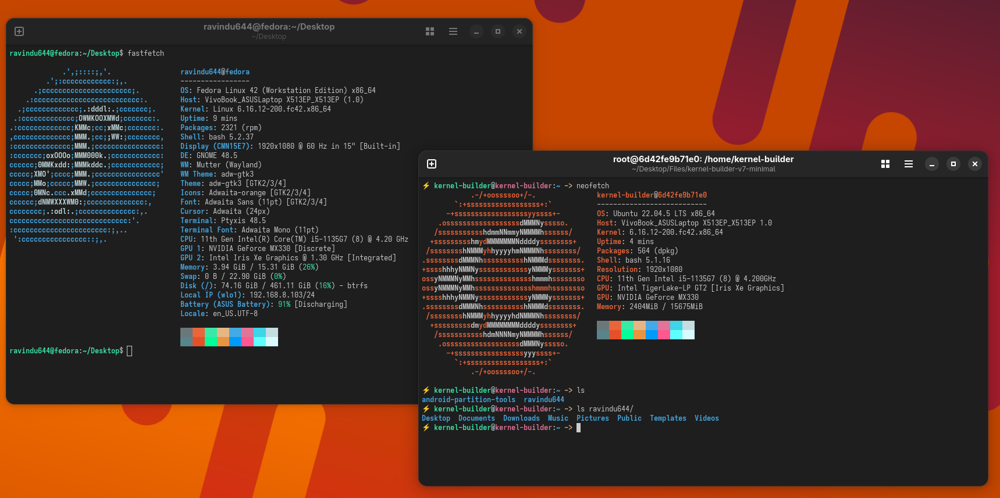

Screenshot of the Ubuntu-based Docker container running on Fedora. Click to view in full quality.

</details>

But, if you don't want to use the Docker container, here are the commands to install the dependencies for Ubuntu/Fedora:

<details>
<summary>🟧 Ubuntu/Debian-based distributions (Ubuntu, Linux Mint, Debian, etc.)</summary>

```bash
sudo apt update && sudo apt install -y \
	build-essential bc bison flex patch pkg-config git curl tar xz-utils zip unzip \
	cpio rsync kmod perl python3 python-is-python3 libssl-dev libelf-dev pahole \
	libncurses-dev zlib1g-dev libyaml-dev lz4 zstd device-tree-compiler adb fastboot
```

> [!NOTE]
> Ubuntu 24.04+ no longer ships `libtinfo5`, which the old Snapdragon LLVM toolchain (Linux 5.4 / qGKI) needs.
> Don't hunt for the `.deb`, the build scripts detect this and point that toolchain at your system `libtinfo.so.6` instead.
</details>

<details>
<summary>🟦 Fedora/Red Hat-based distributions (Fedora, CentOS, RHEL, etc.)</summary>

```bash
sudo dnf install -y --skip-unavailable \
	make gcc gcc-c++ bc bison flex patch pkgconf git curl tar xz zip unzip \
	cpio rsync kmod perl python3 openssl openssl-devel openssl-devel-engine \
	elfutils-libelf-devel dwarves ncurses-devel ncurses-compat-libs \
	zlib-devel libyaml-devel lz4 zstd dtc android-tools
```

</details>

> [!NOTE]
> If you use a build script from this repo, **you can skip this step.** The script checks these packages every time it runs and installs only the ones you are missing.

## Quick links

01. 📁 [Downloading the kernel source](#-01-downloading-the-kernel-source)
02. 🧠 [Understanding the kernel root](#-02-understanding-the-kernel-root)
03. 🧠 [Understanding non-GKI and GKI kernels](#-03-understanding-non-gki-and-gki-kernels)
04. 🧰 [Choosing the right compiler](#-04-choosing-the-right-compiler)
05. 👀 [Preparing for the compilation](#-05-preparing-for-the-compilation)
06. 🔧 [Customizing the kernel, temporary method](#-06-customizing-the-kernel-temporary-method)
07. 🔧 [Customizing the kernel, permanent method](#-07-customizing-the-kernel-permanent-method)
08. 🔓 [Nuking Samsung's anti-root protections](#-08-nuking-samsungs-anti-root-protections)
09. 🟢 [Additional patches](#-09-additional-patches)
10. ✅ [Compiling the kernel](#-10-compiling-the-kernel)
11. 🟥 [Fixing known compiling issues](#-11-fixing-known-compiling-issues)
12. 🟡 [Building a signed boot image](#-12-building-a-signed-boot-image)

---

> [!NOTE]
> If you are not a beginner and want to build a GKI 2.0 kernel from the official Google sources, jump to the [gki-2.0](https://github.com/ravindu644/Android-Kernel-Tutorials/tree/gki-2.0) branch.
>
>
> Some of those sources (`android14-5.15`, `android14-6.1`, `android15-6.6`) need
> Bazel rather than plain `make`. See [Building GKI 2.0 kernels with Bazel](./additional-guides/bazel.md).
>
> Credit to [@TheWildJames](https://github.com/TheWildJames) for the awesome tutorial!

---

## 📁 01. Downloading the kernel source

- **⚠️ If your device is Samsung,**

### 01. Download the kernel source from [Samsung Opensource](https://opensource.samsung.com/main)

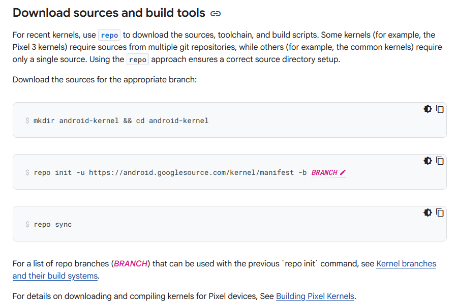

### 02. Extract the `Kernel.tar.gz`

```bash
tar -xvf Kernel.tar.gz && rm Kernel.tar.gz
```

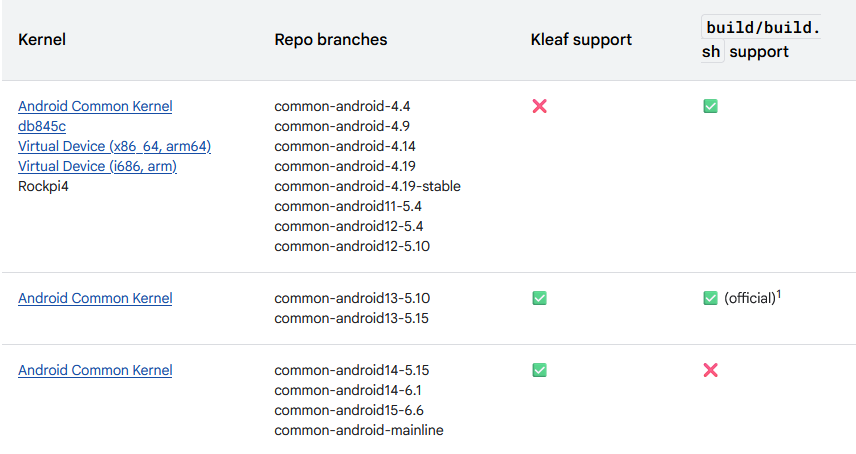

**Note:** It's good practice to fix the permissions on the extracted kernel tree before you start working on it - take ownership of the directory and clear the read-only attributes on the files and folders. Otherwise you'll hit problems editing files and upstreaming the kernel later.

**Run this to fix it:**

```bash
sudo chown -R "$(id -un):$(id -gn)" "/path/to/extracted/kernel/" && \
  chmod -R u+rwX "/path/to/extracted/kernel/"
```

**Before:**


**After:**
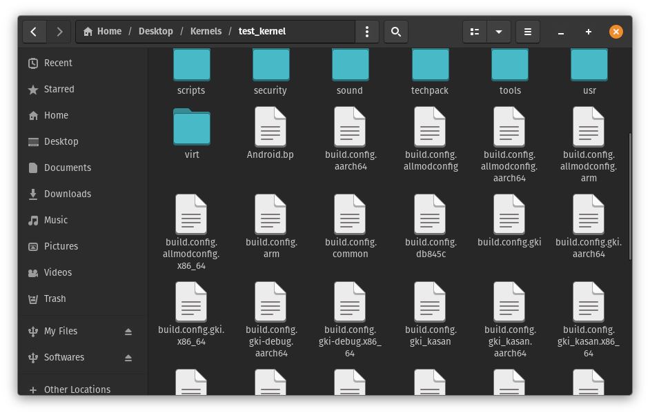

---

- **⚠️ For other devices,** You can find them by your OEM's sites or from your OEM's **official** GitHub repos:

  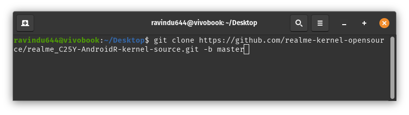

## 🧠 02. Understanding the kernel root

You downloaded a source code archive, but which folder inside it is the actual kernel? That folder is called the **kernel root,** and every command in this guide runs from there.

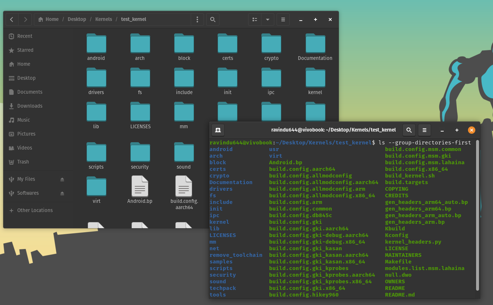

- As you can see in the above screenshot, it's the Linux kernel source code.
- It must have those folders, **highlighted in blue in the terminal.**
- **In traditional GKI kernels,** the kernel root is located in a folder named "common".

- **In GKI Samsung Qualcomm kernel sources**, you should use the `common` kernel instead of `msm-kernel` for compilation.
- **In some GKI Samsung MediaTek kernel sources**, the kernel root is named `kernel-VERSION.PATCHLEVEL`.
  - e.g., `kernel-5.15`

> [!TIP]
> A quick way to confirm you are in the right place: run `make kernelversion` there. If it prints a version number like `5.15.123`, that's your kernel root.

## 🧠 03. Understanding non-GKI and GKI kernels

### 01. GKI project introduction

- **Generic Kernel Image,** or **GKI,** is an Android's project that aims for reducing kernel fragmentation, (and also improving Android stability), **by unifying kernel core and moving SoC and Board support out of the core kernel into loadable vendor modules.**

### 02. `pre-GKI`/`non-GKI` and `GKI` linux version table

| Pre-GKI | GKI 1.0 | GKI 2.0 |
|---------|---------|---------|
| 3.10    | 5.4     | 5.10    |
| 3.18    |         | 5.15    |
| 4.4     |         | 6.1     |
| 4.9     |         | 6.6     |
| 4.14    |         |         |
| 4.19    |         |         |

#### Explanation:

1. **pre-GKI or non-GKI**:
   - The oldest Android kernel branch, likely starts from Linux version 2.x.
   - These kernels are **device-specific** because its often heavily modified to accommodate SoCs and OEMs needs.
   - Starting to get deprecated in ACK, since `linux-4.19.y` branch already reaching EoL (End of Life) state, with last Linux 4.19.325

2. **GKI 1.0**:
   - Android's first generation of the Generic Kernel Image, starting with kernel version **5.4**.
   - This first generation of GKI only have android11-5.4 and android12-5.4 branch and Google announced that GKI 1.0 is deprecated.
   - The first generation of GKI is not yet matured as second generation of GKI, as its failed to reach GKI project goals.
   - These kernels are considered as **device-specific**, but more commonized, depends on how OEMs and SoCs Manufacturer treat them.
   - SoC Manufacturers often modify GKI 1.0 kernel to add their SoC features. From this modifications, the term **Mediatek GKI (mGKI)** and **Qualcomm GKI (qGKI)** exist.

3. **GKI 2.0**:
   - Android's second generation of the Generic Kernel Image, starting with kernel version **5.10**.
   - In this second generation, GKI project starting to get matured properly.
   - This kernel is considered as "universal", since you can boot a GKI kernels that builded with Google's GKI kernel source on **some** devices, if correct and match.

### Notes:

- **LTS = Long-Term Support**: These kernels are stable, well-maintained, and receive long-term updates.
- **GKI = Generic Kernel Image**: A unified kernel framework introduced by Google to standardize the kernel across Android devices.
- **SoC = System on Chip**
- **ACK = Android Common Kernel**: An Android's linux LTS kernel branch, modified to accommodate Android needs.
- OEMs like Samsung may still modify GKI 2.0 kernels to accommodate their needs, and can cause some issues like broken SD Card and broken Audio.
  - **So, use their GKI kernel source instead if possible.**

- For 4.19 kernels, they are predominantly non-GKI implementations, as true GKI was not officially introduced until kernel 5.4 with Android 11.

  - OEMs typically use heavily customized, device-specific implementations based on the Android Common Kernel for 4.19. You can refer to the Android Common Kernel repository if you are interested.
  - For your information, there was experimental GKI development with 4.19 (android-4.19-gki-dev branch), but this was not widely deployed. Official GKI implementation began with kernel 5.4.
  - Examples:
     1. Most Samsung devices with kernel 4.19 use non-GKI implementations with OEM-specific modifications.
     2. True GKI adoption became standard with newer devices shipping Android 11+ with kernel 5.4 or higher.

## 🧰 04. Choosing the right compiler

Your phone's kernel was built with a specific compiler. If you build it with something too new or too old, the build fails, or worse, it builds fine and then refuses to boot. So this step comes before anything else.

### 01. Check your kernel version

Run this inside your kernel root:

```bash
make kernelversion
```

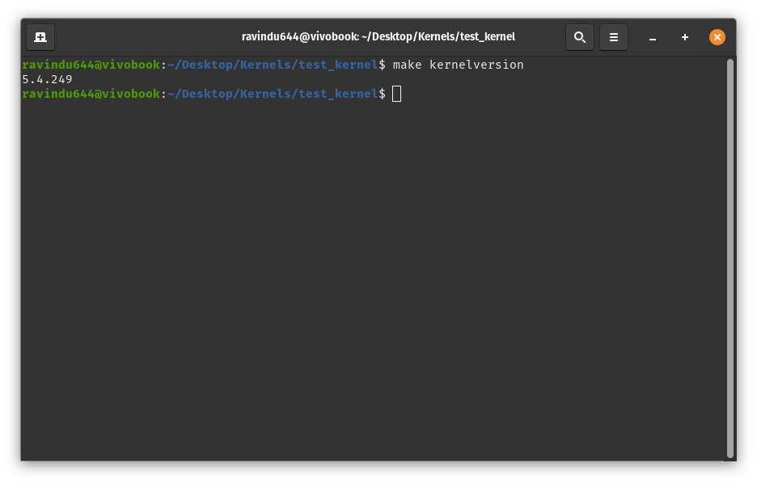

You can also read it straight from the `Makefile` at the top of the kernel root:

  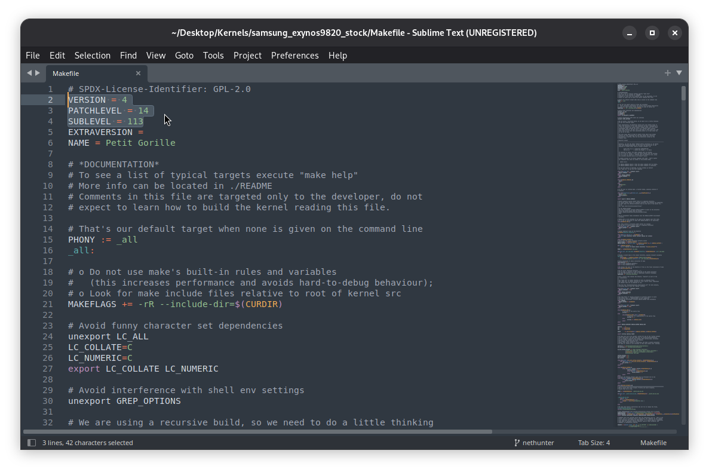
  *Kernel version = `VERSION.PATCHLEVEL.SUBLEVEL`*

Only the first two numbers matter here. `4.14.113` is a **4.14** kernel, `5.15.123` is a **5.15** kernel.

### 02. Pick the compiler for that version

Here is the short version of the table. Full details and download links are [here](./toolchains/), based on my own experience.

| Kernel version | Build script | Toolchain it uses |
| --- | --- | --- |
| 4.9 | `build_4.9.sh` | Proton Clang 12 + Linaro GCC 7.5 |
| 4.14 (OEM/stock source) | `build_4.14.sh` | clang-r383902b + ARM GNU |
| 4.14 (AOSP/LineageOS source) | `build_4.14_aosp.sh` | Neutron Clang |
| 4.19 | `build_4.19.sh` | clang-r353983c + ARM GNU |
| 5.4 (Qualcomm, aka qGKI) | `build_5.4.sh` or `build_qGKI.sh` | Snapdragon LLVM + ARM GNU |
| 5.10 | `build_5.10.sh` | clang-r416183b |
| 5.15 | `build_5.15.sh` | clang-r450784e |
| 6.1 and newer | `build_6.1.sh` | Neutron Clang |

`build_5.4.sh` and `build_qGKI.sh` are the same script under two names, because qGKI kernels are 5.4 kernels.

> [!NOTE]
> **You don't have to download any of these toolchains by hand.** If you use a build script, it downloads the right one into `~/toolchains` on the first run. This table is here so you know what your script is doing.

### 03. Clang only, or Clang plus a GCC cross compiler?

This trips up a lot of beginners, so here it is in plain words.

- **Linux 4.9 up to 5.4:** you need **both** a Clang and a GCC cross compiler. The kernel's build system of that era still calls GCC tools like `aarch64-linux-gnu-ld` and `aarch64-linux-gnu-as` to assemble and link, even when Clang compiles the C code.

- **Linux 5.10 and newer:** you only need **Clang**. Passing `LLVM=1` tells the kernel to use the LLVM versions of every tool (`clang`, `ld.lld`, `llvm-ar`, `llvm-nm`, `llvm-objcopy`, `llvm-strip`), so no GCC cross compiler is downloaded or used at all.

`LLVM_IAS=1` goes with it. It tells Clang to assemble the code itself instead of calling an external assembler. On 5.15 and newer this is already the default, so you will see it passed mostly for 5.10.

If you look inside the newer build scripts, this is the whole compiler setup:

```bash
BUILD_OPTIONS=(
    -j"$(nproc)"
    ARCH=arm64
    LLVM=1
    LLVM_IAS=1
    HOSTCC=gcc
    HOSTCXX=g++
)
```

No `CROSS_COMPILE` and no GCC anywhere. Just Clang :)

## 👀 05. Preparing for the compilation

- There are 2 ways to compile the kernel.

1. **Without** a build script.
2. **With** a build script.

If you are a beginner, I recommend trying to build the kernel without a build script first. Once you understand the logic, you can then use a build script to make your life easier :)

---

## 🟠 Method 1: Without a build script.

This method is here so you understand what a build script does for you. Everything below is done by hand.

### 01. Download and extract your compiler.

You already know which compiler you need from [step 04](#-04-choosing-the-right-compiler). Download it and extract it into its own folder, like this:

  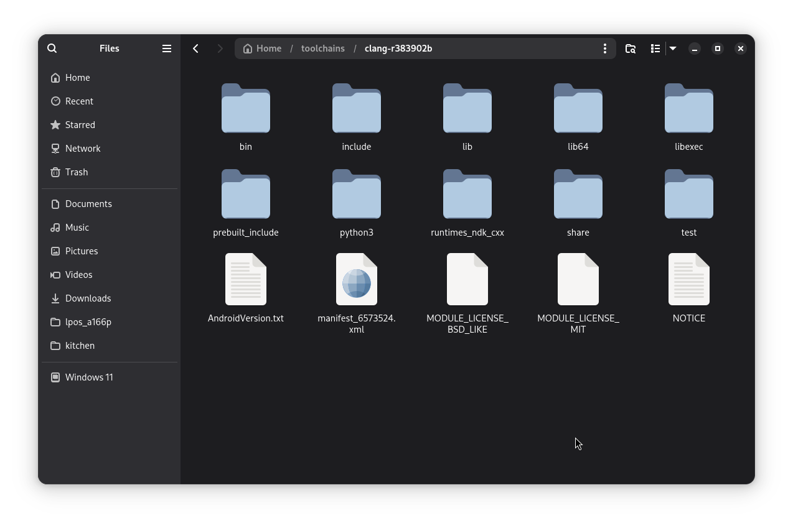
  *Extracted clang*

  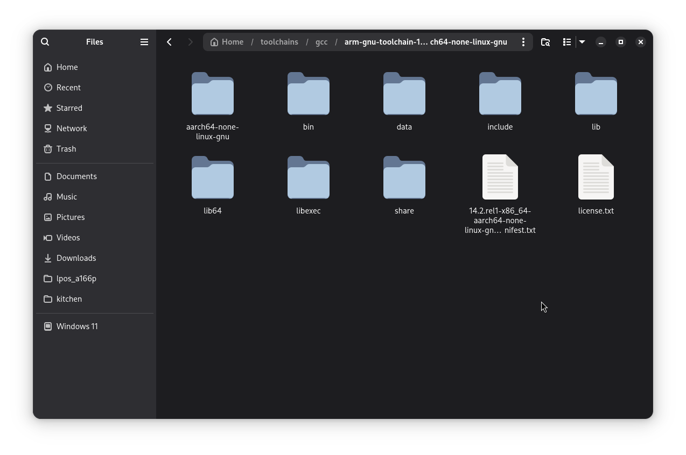
  *Extracted cross compiler (only needed for 4.9 up to 5.4)*

In my case the kernel is **4.14.113**, so I use [clang-r383902b](https://github.com/ravindu644/Android-Kernel-Tutorials/releases/download/toolchains/clang-r383902b.tar.gz) and [arm-gnu-toolchain-14.2.rel1](https://github.com/ravindu644/Android-Kernel-Tutorials/releases/download/toolchains/arm-gnu-toolchain-14.2.rel1-x86_64-aarch64-none-linux-gnu.tar.xz).

---

### 02. Exporting the compiler locations to the PATH

- Even though we downloaded the right compilers, our system (Host OS) will not automatically know which compiler to use for building our kernel.

- By default, it will use the system's compilers, which might be incompatible with older kernels.
  - In such a case, the build will fail instantly.

- So, our task is to wire up the downloaded compilers to our system's `PATH`.
  We must tell the system: "use the `clang` binary from here, not your own clang!"

---

#### 💡 What is `PATH`?

`PATH` is an environment variable in Linux/Unix that stores a list of directories.

When you type a command (like `clang` or `gcc`), the system looks through the directories in `PATH` **from left to right** to find the first matching executable.

By adding your downloaded compiler's folder to **the begining of the** `PATH`, you make sure the build system picks **your compiler** instead of the system default.

---

- To check what your `PATH` variable looks like, you can type `echo $PATH` in the terminal:

  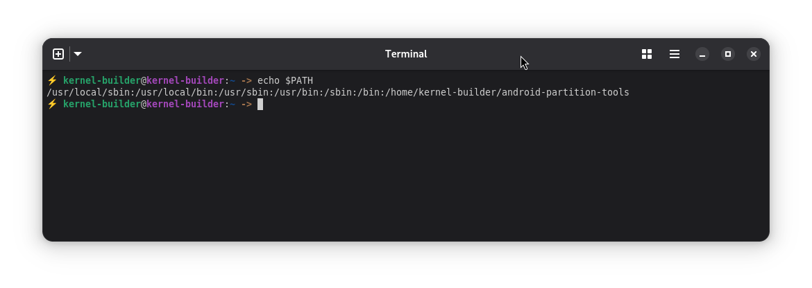
  - Our goal is to add our compilers' locations to the left side of `/usr/local/sbin` :)

- In the extracted compiler folders, the binary files (executables) are usually located inside the `bin` folder, like this:

  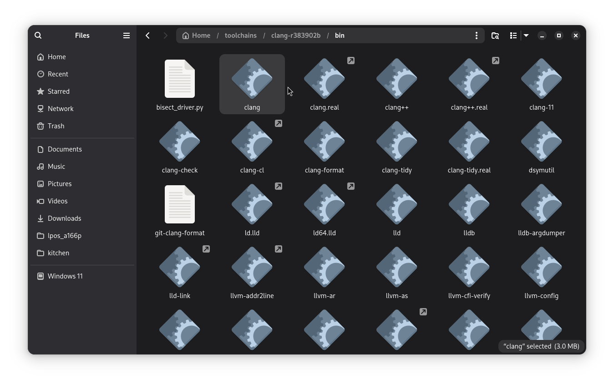

- Copy the full path to that `bin` folder and export those locations to the `PATH` like this:

  ```bash
  export PATH="/path/to/first/compiler/bin:/path/to/second/compiler/bin:$PATH"
  ```

- **In my case,** it looked like this:

  ```bash
  export PATH="/home/kernel-builder/toolchains/clang-r383902b/bin:/home/kernel-builder/toolchains/gcc/arm-gnu-toolchain-14.2.rel1-x86_64-aarch64-none-linux-gnu/bin:$PATH"
  ```

**As you can see, we have successfully exported the toolchains to our `PATH`:**

  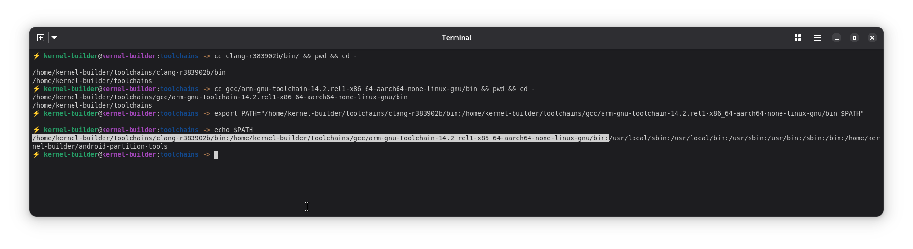

**For confirmation,** type `clang -v` in the terminal to verify that it is actually wired up!

  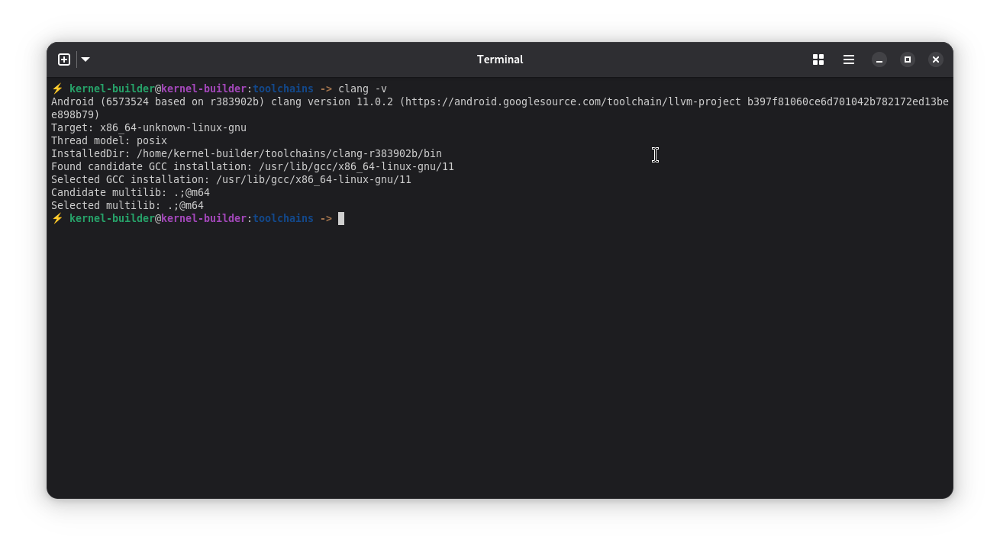
  *We did it!*

---

### 03. Compiling the kernel with `make`

- Keep in mind that the `PATH` variable we exported in Step 02 is **only valid in the currently opened terminal.**

  **So, don't close it** - use that terminal window to navigate the kernel source and run commands for further compilation.

- **Now,** using that terminal window, navigate to your **root of the kernel source** like this: `cd /path/to/kernel-root`

  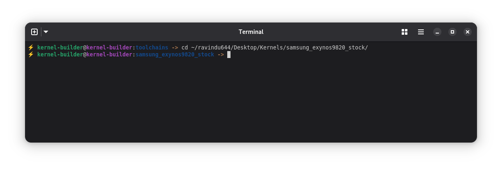

---

**💡 Better to Know:** A **defconfig** (default configuration) is like a preset settings file for the kernel.

- It tells the build system which features to enable or disable.
- Common defconfig locations are `arch/arm64/configs` or `arch/arm64/configs/vendor`.

---

- **In my case,** my defconfig is located at `arch/arm64/configs`, and its name is `exynos9820-beyondxks_defconfig`.

  - **Also,** I have multiple defconfigs made for my **specific purposes**, named: `common.config`, `ksu.config`, and `nethunter.config`.
  - You can also create your own customized defconfigs for specific changes (more on that later)!

- Now, we need to tell our compilers to "use these defconfigs to build the kernel"!
- To do that, simply run the following command:

```bash
make \
  ARCH=arm64 \
  CC=clang \
  CROSS_COMPILE=aarch64-none-linux-gnu- \
  CLANG_TRIPLE=aarch64-none-linux-gnu- \
  your_defconfig your_second_defconfig your_third_defconfig
```

---

**💡 Explanation:**

1. **ARCH=arm64** → Specifies the architecture of the kernel we are building.

    - In our case, it is 64-bit ARM.

2. **CC=clang** → Tells `make` to use the `clang` compiler.

    - **Don't change this value.** Keep it as it is!

3. **CROSS_COMPILE=aarch64-none-linux-gnu-** → Prefix for the cross-compiler binaries (e.g., `aarch64-none-linux-gnu-gcc`).

    - You can get this value by opening your GCC's `bin` folder. All the binaries have the same prefix!

    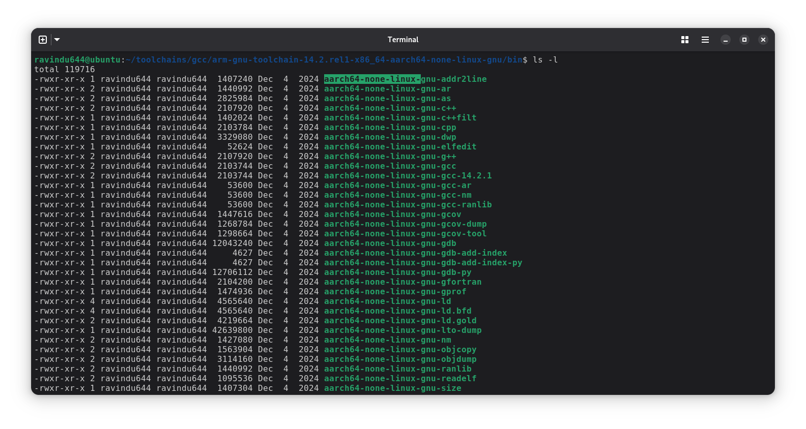
    *See the highlighted part. `aarch64-none-linux-gnu-` is the common prefix for all the binaries, and it is the value for the `CROSS_COMPILE` variable.*

4. **CLANG_TRIPLE=aarch64-linux-gnu-** → Tells Clang exactly which target architecture, OS, and ABI to compile for.

    - Ensures the kernel build system can enable features and flags specific to ARM64 Linux.
    - This does **not** require a literal binary named `aarch64-linux-gnu-` in your path. Clang uses it internally as a target specification.
    - You can also use `aarch64-none-linux-gnu-` as the triple; the vendor field (`none`) is usually ignored by Clang.

5. **your_defconfig ...** → These are the configuration files (`defconfigs`) that define which kernel features, drivers, and options to include in the build.

**This is the barebone `make` command for a 4.9 up to 5.4 kernel. Don't remove any part of it!**

> [!IMPORTANT]
> **Building a 5.10 or newer kernel?** Drop `CROSS_COMPILE` and `CLANG_TRIPLE`, and use `LLVM=1 LLVM_IAS=1` instead:
>
> ```bash
> make ARCH=arm64 LLVM=1 LLVM_IAS=1 your_defconfig
> ```
>
> You don't need the GCC cross compiler for those kernels at all. See [step 04](#-04-choosing-the-right-compiler) for the reason.

---

- Now, when you run that above command, the build system will read all of your `defconfig` files and merge them into a single file called `.config` !

  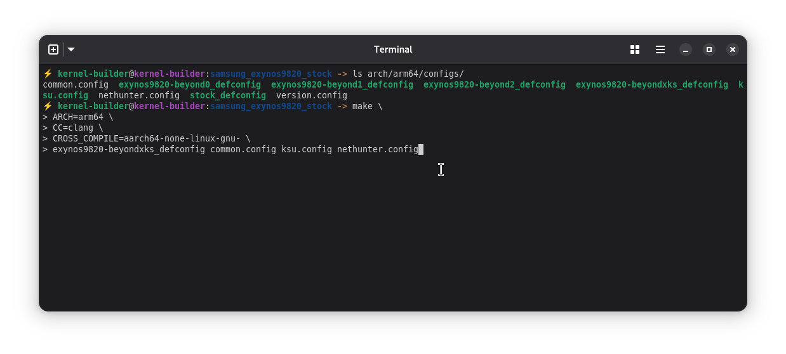
  *Screenshot **before** running the command*

  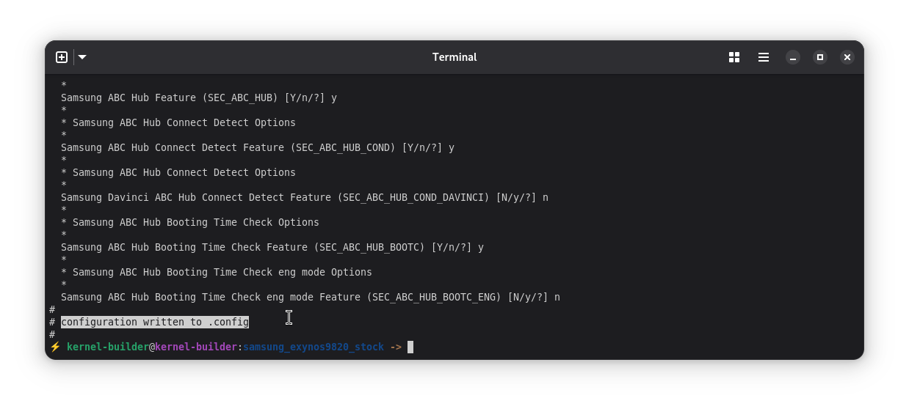
  *Screenshot **after** running the command*

**This will write the final configuration to a hidden file named `.config`, which will be used by the build system to compile the kernel:**

  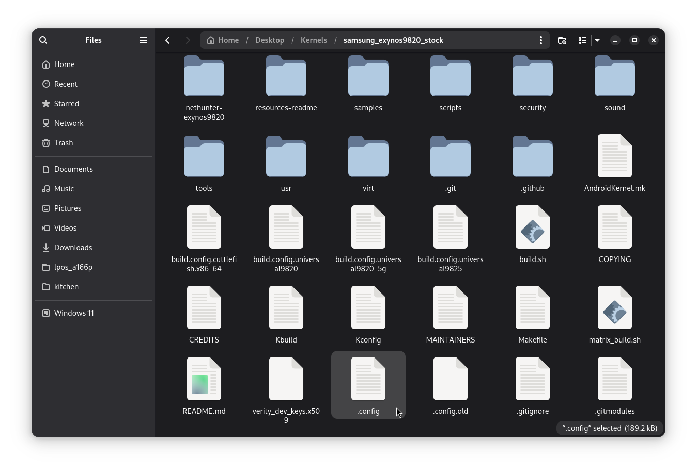

---

- Before compiling the kernel, if you want to edit the contents of the `.config` in a GUI way, you can use the `menuconfig` tool.

- To launch `menuconfig`, type the same beginning of the command you used to create the `.config` (i.e., the `CC` and `CROSS_COMPILE` parts), but at the end, instead of defconfig names, use `menuconfig` like this:

```bash
make \
  ARCH=arm64 \
  CC=clang \
  CROSS_COMPILE=aarch64-none-linux-gnu- \
  CLANG_TRIPLE=aarch64-none-linux-gnu- \
  menuconfig
```

  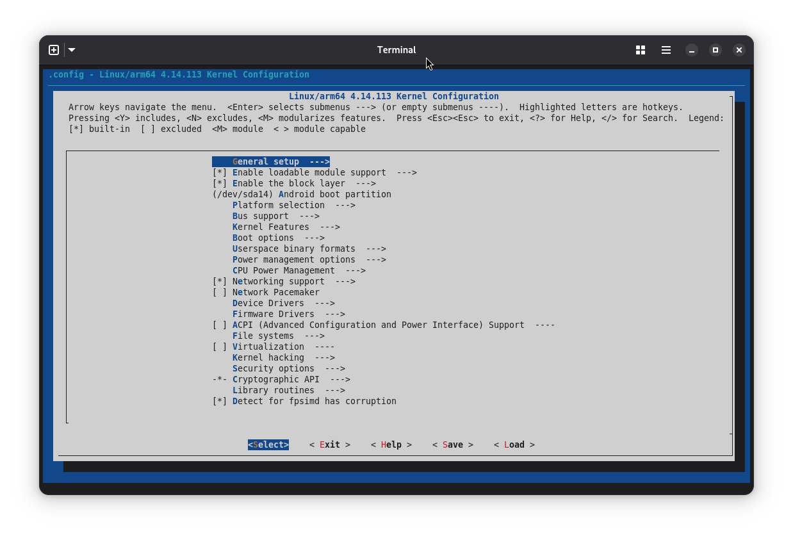
  *It will open something like this. Feel free to edit it according to your needs.*

**Use the arrow keys to navigate through `menuconfig`. Once you are done editing, exit `menuconfig` to proceed with building the kernel.**

**Note:** The customization part is not discussed here; it is covered in Method 2. This is just the barebones of "Compiling the kernel."

---

- Now, we have successfully created the final configuration file (`.config`) and, if needed, customized it using `menuconfig`.

- The only thing left to do is compile the kernel!

- To compile, run the same command as before with the same beginning (the `ARCH`, `CC`, and `CROSS_COMPILE` parts), but this time **do not specify any defconfig or menuconfig at the end**. Like this:

```bash
make \
  ARCH=arm64 \
  CC=clang \
  CROSS_COMPILE=aarch64-none-linux-gnu- \
  CLANG_TRIPLE=aarch64-none-linux-gnu-
```

---

### 💡 What this does:

This command tells the build system to start compiling the kernel immediately using the `.config` you just created. All the settings and options from `.config` will now guide the build process.

---

**Once you run the above command, the build system will start compiling the kernel in the same kernel root directory:**

  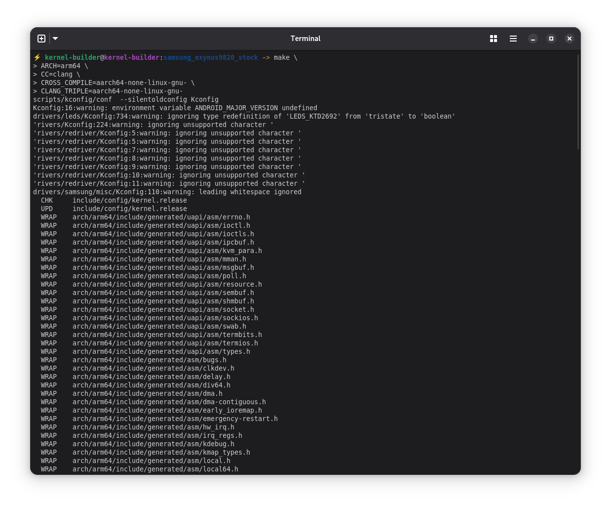

**When it finishes, your kernel image is at `arch/arm64/boot/Image`.**

### Barebone training is enough

**Let's jump into the easiest and laziest method you can do xD**
**We'll explore the compilation more deeply in `Method 02`!**

---

## 🟠 Method 2: With a build script.

A build script does everything from Method 1 for you: it installs missing packages, downloads the right compiler, exports the `PATH`, runs `make` with the correct options, and copies the finished kernel somewhere easy to find.

### 01. Download the script and put it in your kernel root.

Go to [build_scripts](./build_scripts/) and pick the script that matches your kernel version, using the table in [step 04](#-04-choosing-the-right-compiler) or the one on that page. Download it and place it **inside your kernel root**, next to the `Makefile`:

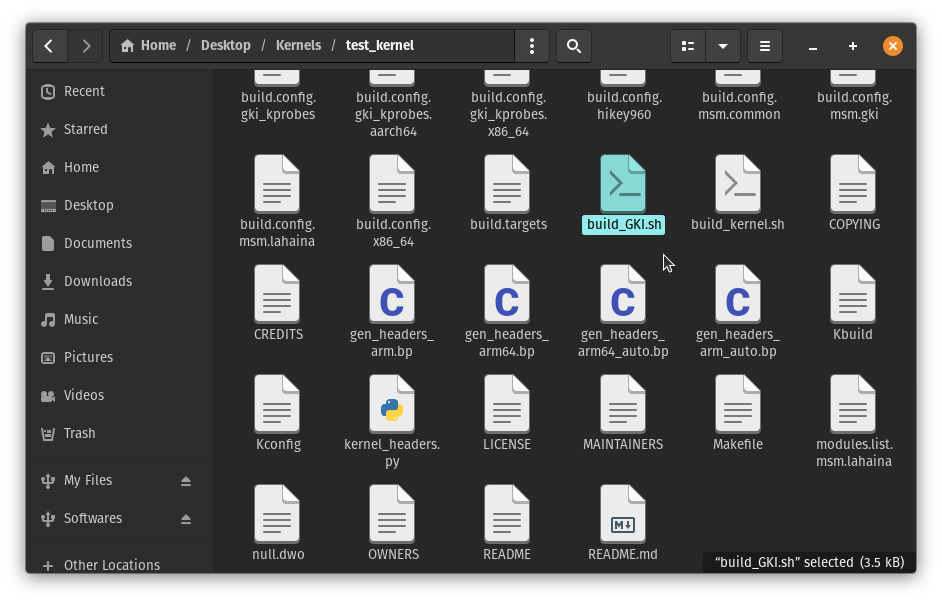

> [!NOTE]
> The script must sit in the kernel root. If you run it from anywhere else it stops immediately with `Run this from the kernel source root.` instead of failing halfway through a build.

---

### 02. Edit the SETTINGS block.

Open the script in a text editor. The top of every script looks like this, and **it is the only part you normally need to touch:**

```bash
# ---------------------------------------------------------------------------
#  SETTINGS -- the only part you normally need to touch
# ---------------------------------------------------------------------------
DEFCONFIG="gki_defconfig"      # name from arch/arm64/configs (also: vendor/foo_defconfig)
EXTRA_CONFIGS=()               # fragments merged on top, e.g. (custom.config)
KERNEL_IMAGE="Image"           # Image | Image.gz | Image.gz-dtb  (MediaTek needs Image.gz)
USE_OUT_DIR=1                  # 0 = build in-tree; most Samsung Exynos trees need 0
MENUCONFIG=1                   # 0 = skip the menuconfig GUI
export KBUILD_BUILD_USER="@ravindu644"

# Some OEM trees need extra variables -- check README_Kernel.txt or build_kernel.sh:
# export TARGET_SOC=s5e9925 PLATFORM_VERSION=12 ANDROID_MAJOR_VERSION=s
# ---------------------------------------------------------------------------
```

Here is what each setting does:

**`DEFCONFIG`** is the only one you *must* change.

- Set it to your device's defconfig, which lives in `arch/arm64/configs`.
- On GKI 2.0 kernels it is normally `gki_defconfig`.
- Not sure which one is yours? Look inside `arch/arm64/configs` and `arch/arm64/configs/vendor`.
- If your defconfig is inside the `vendor` folder, include that folder name too:

    ```bash
    DEFCONFIG="vendor/name_of_the_defconfig"
    ```

    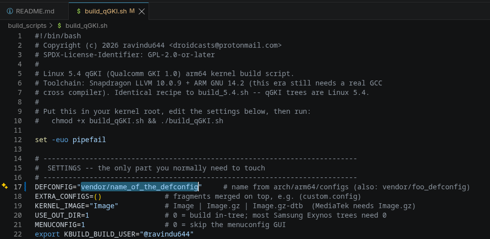

**`EXTRA_CONFIGS`** is a list of extra config fragments merged on top of your defconfig.

- Leave it as `()` for now. You will use it in the [Permanent Method](#-07-customizing-the-kernel-permanent-method) section:

    ```bash
    EXTRA_CONFIGS=(custom.config)
    ```

- You can list more than one: `EXTRA_CONFIGS=(custom.config ksu.config)`

**`KERNEL_IMAGE`** is which kernel image to build.

- `Image` is the raw one and works for most devices.
- 🔴 **MediaTek devices usually cannot boot a raw `Image`,** so set it to `Image.gz` there.
- Some older trees want `Image.gz-dtb`.

**`USE_OUT_DIR`** decides where the build happens.

- `1` builds into a separate `out` folder, which keeps your source clean.
- ❗ **Samsung Exynos trees usually cannot build into a separate folder,** so set it to `0` there. The build then happens inside the kernel root itself.

**`MENUCONFIG`** decides whether the config GUI opens before the build.

- `1` opens `menuconfig` every time, which is what the [Temporary Method](#-06-customizing-the-kernel-temporary-method) section uses.
- Set it to `0` once you are done experimenting and just want the build to run start to finish.

**`KBUILD_BUILD_USER`** is the "built by" name baked into the kernel. Put your own name there :)

---
> [!IMPORTANT]
> If your device is Samsung, it usually uses some device-specific variables in
> "some" kernels.

- **As an example,** in the Galaxy S23 FE kernel source code, we can see they used variables called `TARGET_SOC=s5e9925`, `PLATFORM_VERSION=12`, and `ANDROID_MAJOR_VERSION=s`

- **If we didn't export those variables correctly,** the kernel failed to build in my case.

- Don't worry, they usually mention these required variables in their `README_Kernel.txt` or their own `build_kernel.sh`

  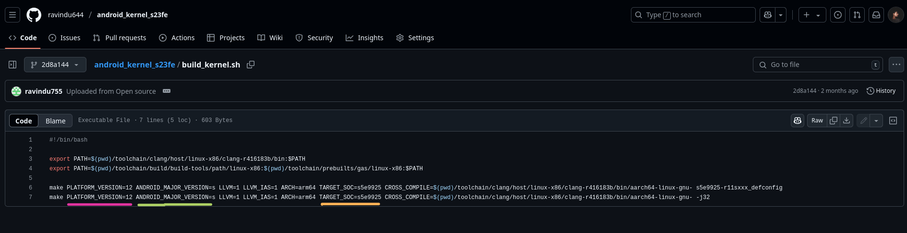

To add them, uncomment the `export` line at the bottom of the SETTINGS block and put your own values there:

```bash
export TARGET_SOC=s5e9925 PLATFORM_VERSION=12 ANDROID_MAJOR_VERSION=s
```

**Note:** Just don't overthink it, even if they use values like 12 and S for Platform and Android versions, even if you have a higher Android version.

---

### 03. Edit the Makefile.

- If you find these variables: ```REAL_CC``` or ```CFP_CC``` in your "Makefile", remove them from the "Makefile", then Search for "wrapper" in your Makefile. If there's a line related to a Python file, remove that entire line/function as well.

  - Example patch of removing the wrapper: [click here](./patches/004.remove_gcc%20wrapper.patch)

---

### 04. Grant executable permissions to the script

```bash
chmod +x build_xxxx.sh
```

### 05. Run the build script

```bash
./build_xxxx.sh
```

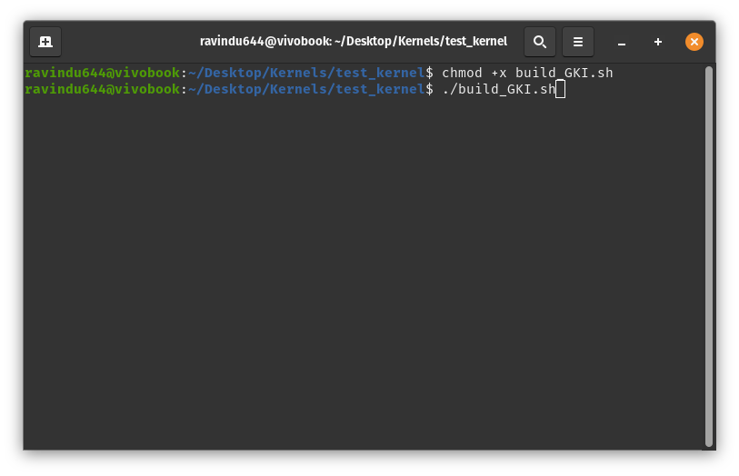

### What happens when you run it

1. **It checks your packages.** It asks your package manager which of the required packages are missing and installs only those. Nothing is installed if you already have everything, so this is quick on every run after the first.

2. **It downloads your toolchain** into `~/toolchains`, but only if it isn't there yet. This is the slow part of the first run, and it only happens once.

    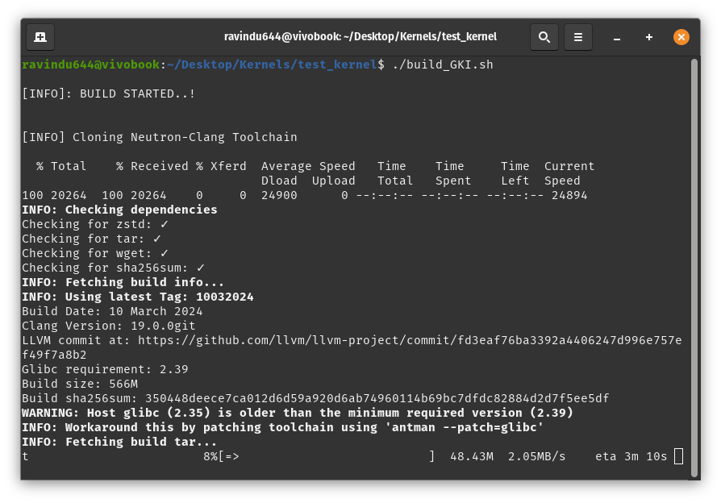

3. **It builds your `.config`** from the `DEFCONFIG` you set, plus anything in `EXTRA_CONFIGS`.

    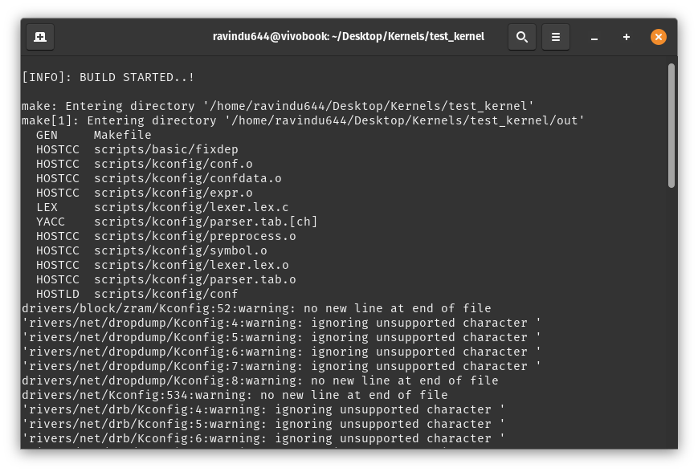

4. **`menuconfig` opens** so you can make changes by hand, unless you set `MENUCONFIG=0`. Close it and the compile starts.

    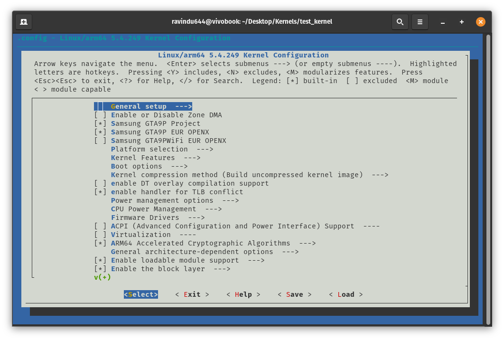

> [!TIP]
> **If the toolchain download fails or you interrupt it, just run the script again.** A failed download deletes its own folder, so the next run starts clean. You do not need to remove `~/toolchains` by hand.

- **Additional notes:**
  - You can completely ignore anything displayed as `warning:`
    - Eg: `warning: ignoring unsupported character '`

---

## 🔧 06. Customizing the kernel, temporary method

- Once the *menuconfig* appears, you can navigate through it and customize the Kernel in a graphical way as needed.

- **As an example,** we can customize **the Kernel name, enable new drivers, enable new file systems, disable security features,** and more :)

You can navigate the *menuconfig* using the arrow keys (← → ↑ ↓) on your keyboard, and press `y` to enable, `n` to disable or `m` to enable as a module `<M>`.

### 1. Changing the Kernel name.

- I guess no explanation is needed for this:

    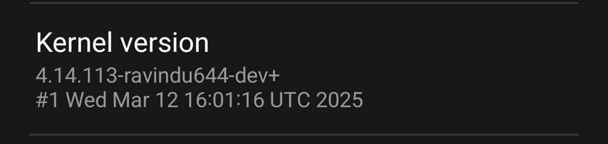

- Located in: `General setup  ---> Local version - append to kernel release`

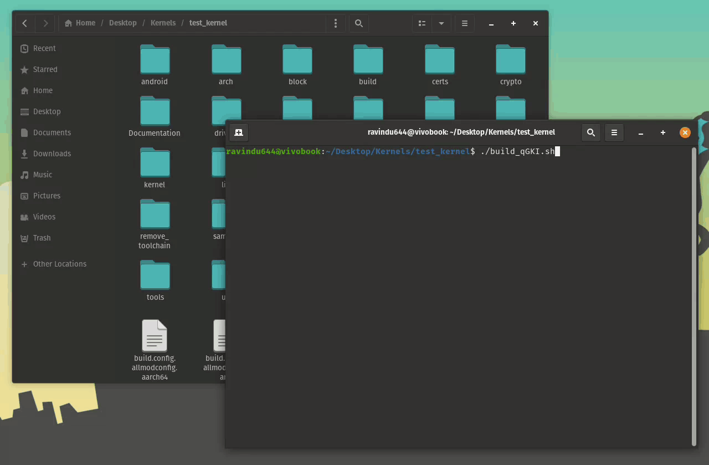

### 2. Enabling BTRFS support.

- Btrfs is a modern Linux filesystem with copy-on-write, snapshots, and built-in RAID, ideal for reliability and scalability.

- Located in: `File systems  ---> < > Btrfs filesystem support`

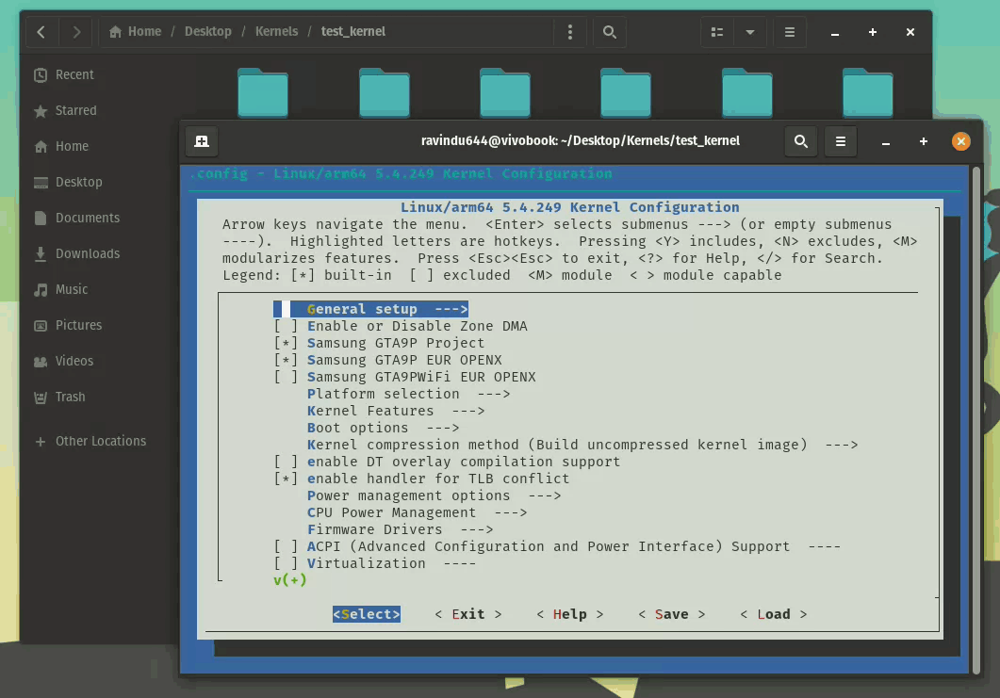

### 3. Enabling more CPU Governors

- **CPU governors control how the processor adjusts it's speed.**
- You can choose between performance-focused governors (like "performance" for max speed) or battery-saving ones (like "powersave").
- Please note that this may impact your SoC's lifespan if the device overheats while handling performance-intensive tasks.

**Enabling more CPU Governors:**

- Located in: `CPU Power Management ---> CPU Frequency scaling`

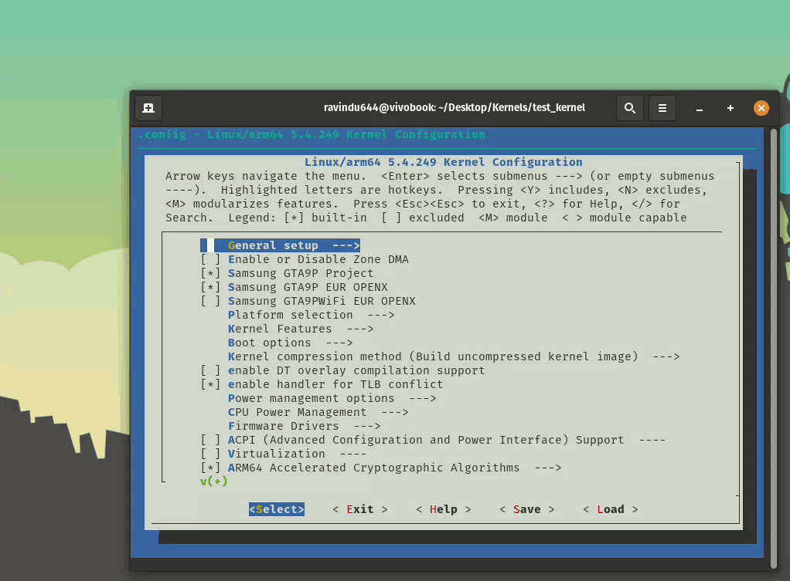

**Changing the Default CPU Governor:**

- Located in: `CPU Power Management  ---> CPU Frequency scaling  ---> Default CPUFreq governor (performance)  --->`

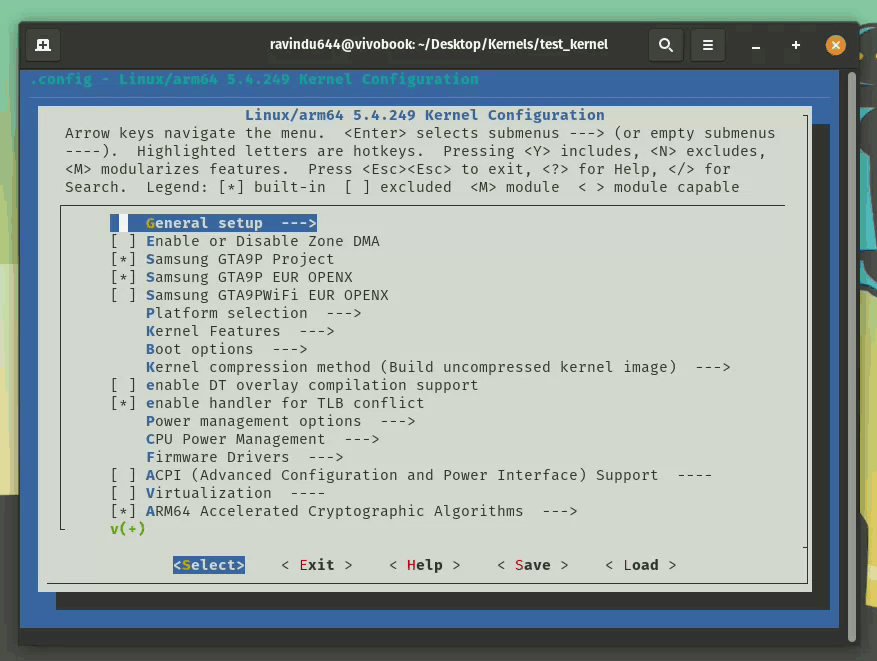

### 4. Enabling more IO Schedulers

- **IO schedulers control how your system handles reading and writing data to storage.**
- Different schedulers can make your system faster or help it run smoother, depending on what you're doing (like gaming, browsing, or saving battery).
- Located in: `IO Schedulers  --->`

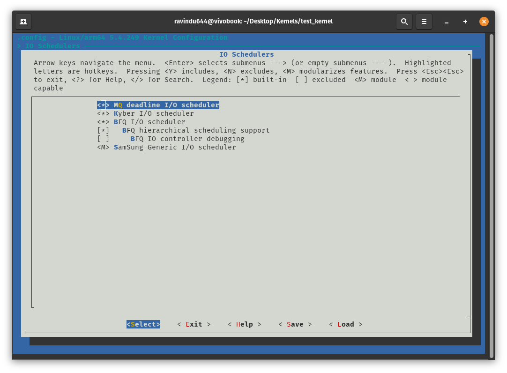

### The problem with menuconfig

You have to do this every time you run the build script.

- All the changes you've made using menuconfig are saved in a hidden file called `.config`. It sits inside the `out` folder, or inside the kernel root if you set `USE_OUT_DIR=0`.

  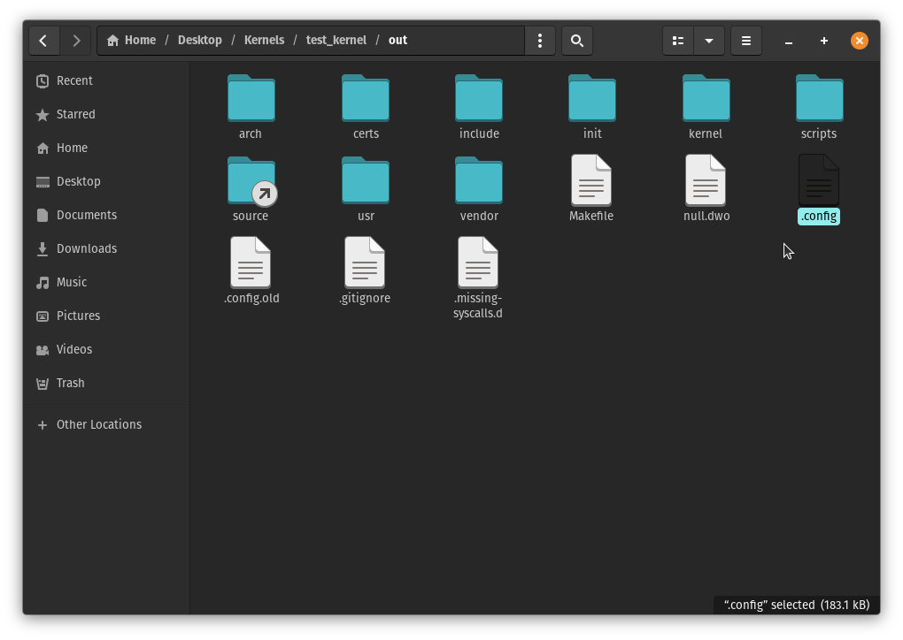

- and it resets every time you run the build script.

  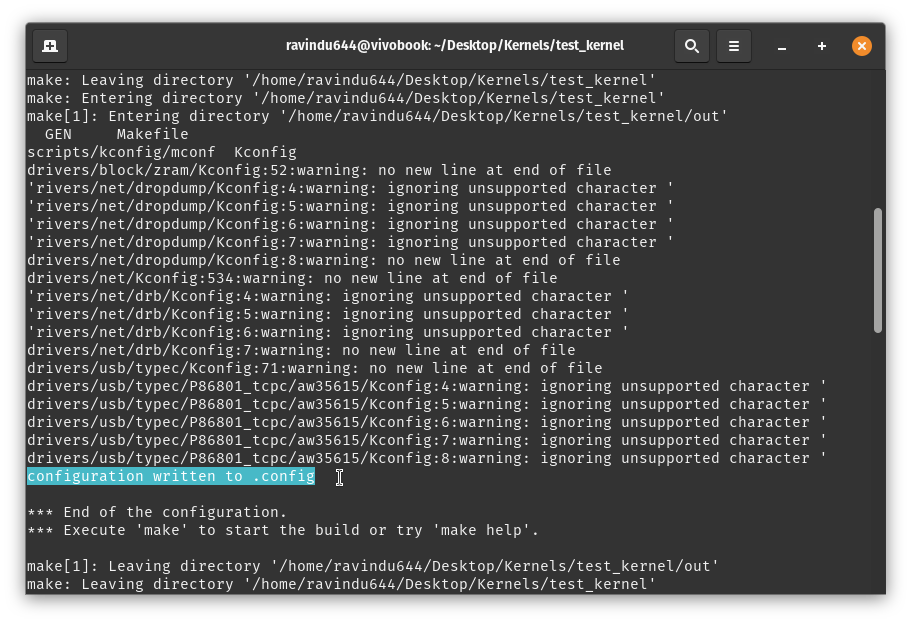

- So, we need a permanent method to save our changes, right?

## 🔧 07. Customizing the kernel, permanent method

- In this method, **we are going to create a separate `custom.config` to store our changes** and **tell the build script to use it.**

- After that, when we run the build script, **it will first use your OEM defconfig to generate the `.config` file, then merge the changes from our `custom.config` into `.config` again.**

### 01. Create the file

Create `custom.config` inside `arch/arm64/configs`, next to your defconfig.

### 02. Tell the script about it

Add it to `EXTRA_CONFIGS` in the SETTINGS block:

```bash
DEFCONFIG="your_defconfig"
EXTRA_CONFIGS=(custom.config)
```

That's it. Your defconfig is applied first, then `custom.config` is merged on top, so anything you put in `custom.config` wins.

> [!NOTE]
> Doing this by hand instead? The same thing works with plain `make`, just list the fragment after your defconfig:
> `make ARCH=arm64 LLVM=1 your_defconfig custom.config`

---

### 🤓 How to add changes to our `custom.config` ?

- First, We have to find the exact **kernel configuration option** you want to **enable** or **disable**.

- Example **kernel configuration option**: `CONFIG_XXXX=y`

  - `CONFIG_XXXX`: The name of the kernel option or feature **( Must begin with `CONFIG_` )**
  - `=y`: This means "yes" -> the option is enabled and will be included in the kernel.
  - `=n`: This means "no" -> the option is disabled.

- You can find the name of the **kernel configuration option** this way:

  - Run the build script and wait until `menuconfig` appears.
  - Navigate to the option/feature you want to enable.
  - Press `shift + ?` on your keyboard, and an explanation about the option/feature will appear.
  - You'll see the name of the **kernel configuration option** in the top-left corner of the menuconfig.

    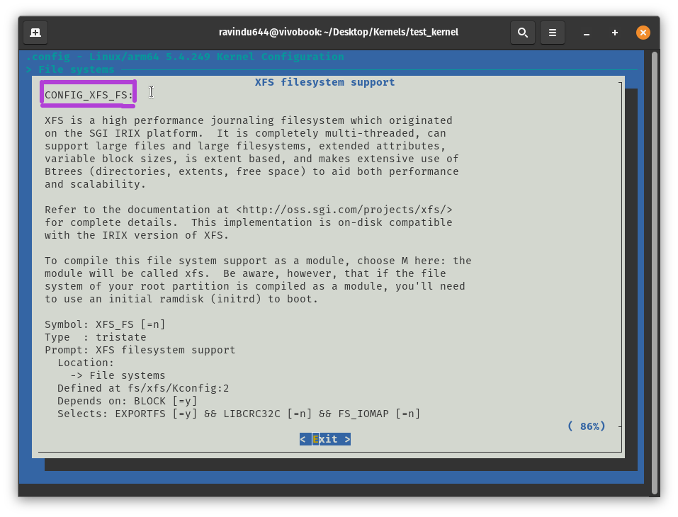

  - **Copy that name** and add it to your `custom.config` with `=y` or `=n` to enable or disable it.

    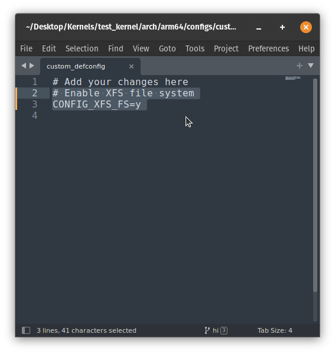

## 🔓 08. Nuking Samsung's anti-root protections

This one has its own page: **[how to remove Samsung's RKP](./samsung-rkp/)**.

## 🟢 09. Additional patches

These are optional. Apply the ones you need with `patch -p1 < filename.patch` from your kernel root, or open the patch in an editor and make the changes by hand, which I recommend for understanding what you are doing.

### 01. To fix broken system funcitons like Wi-Fi, touch, sound etc.
>
> [!NOTE]
> Bypassing this usually not a good practice, because something like this is used as **last effort,**
>
> when there's no open source linux driver found. (e.g Proprietary drivers)
>
> But, for newbies or kernel developer that wanna ship their Loadable Kernel Module, **this is okay.**

---

- On some devices, **compiling a custom kernel can break system-level functionalities like Wi-Fi, touch, sound, and even cause the system to not boot.**

- The reason behind this is that the device can't load the external kernel modules `(*.ko)`, due to linux's prebuilt security feature `(symversioning, signature)` that prevent malicious kernel module to load.

- To fix this issue, [use this patch](./patches/010.Disable-CRC-Checks.patch) to force the kernel to load those modules.

  **Even if you don't have such an issue, using this patch is still a good practice.**

  ---

### 02. Fix: `There's an internal problem with your device.` issue.

**The reason:**

  ```text
Userspace reads /proc/config.gz and spits out an error message after boot
finishes when it doesn't like the kernel's configuration. In order to
preserve our freedom to customize the kernel however we'd like, show
userspace the stock defconfig so that it never complains about our
kernel configuration.
  ```

- To fix this issue, make a copy of your OEM's Defconfig and rename it to `stock_defconfig`.

  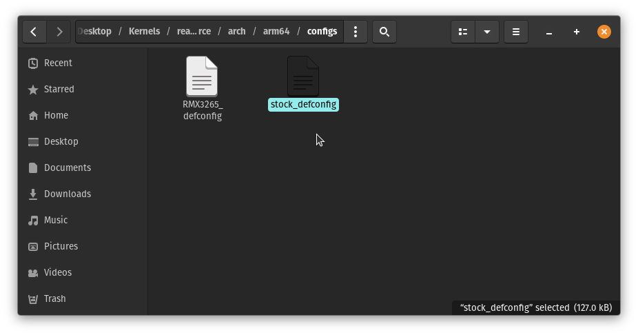

- Then, use the patch below to fool Android into thinking that the defconfig was not changed:

  - [Patch](./patches/011.stock_defconfig.patch), [Commit](https://github.com/ravindu644/android_kernel_a047f_eur/commit/d306bd4c4c84a12be5235e31540f40fb9c1a1066)

  ---

### 03. Booting with SELinux set to permissive

- Handy while you are debugging, because a lot of "it boots but nothing works" problems are just SELinux denials.

- Two patches are involved. The first one adds the toggle to the kernel, the second one turns it on in your defconfig:

  - [Kernel side](./patches/012.force-selinux-permissive.patch), [defconfig side](./patches/013.force-selinux-permissive-defconfig.patch)

- **Don't ship a permissive kernel to normal users.** It removes a real security layer of Android.

  ---

### 04. Wiring up KernelSU hooks

- If you want to add KernelSU support to a kernel that doesn't have the required hooks, this patch adds them manually.

  - [Patch](./patches/016.KernelSU-Hooks.patch)

  ---

### 05. Removing the `-dirty` string from the kernel version

- When you edit the source without committing, the kernel appends `-dirty` to its version string. This patch removes it and appends your own localversion instead.

  - [Patch](./patches/017.nuke_dirty_string.patch)

## ✅ 10. Compiling the kernel

- Once you've customized the kernel as you want, simply **exit menuconfig**.
- After exiting, the kernel will start compiling!


💡 If everything goes smoothly like this,

  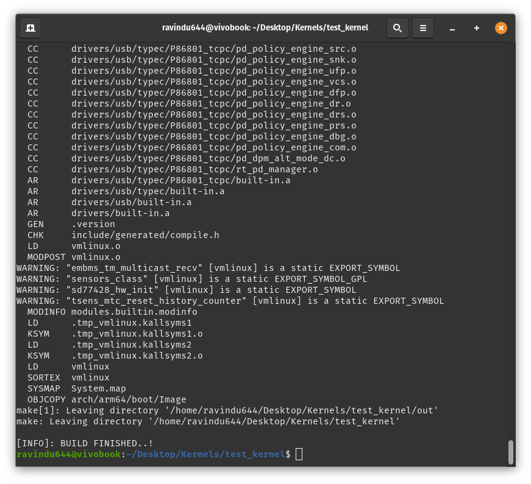

you'll find the built kernel `Image` inside the `build` folder in your kernel root!

  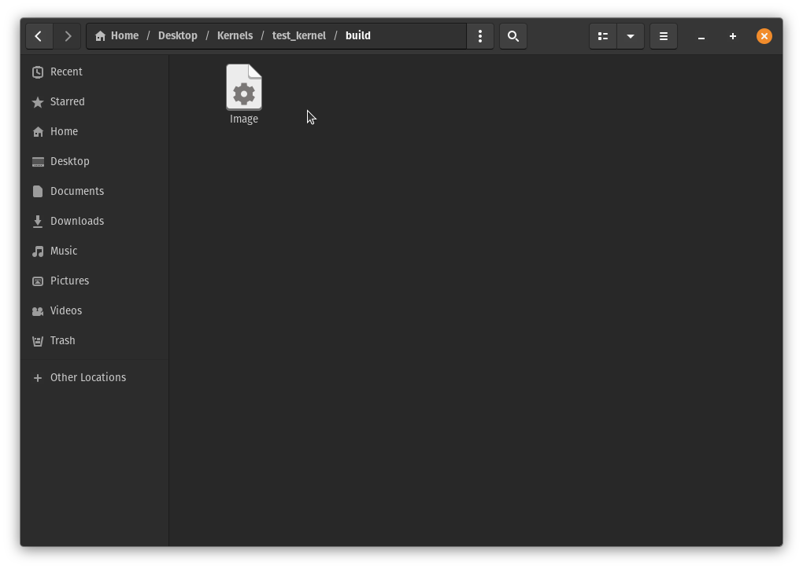

The build script copies it there for you at the end. The original also stays where `make` put it:

- `out/arch/arm64/boot/` when `USE_OUT_DIR=1`
- `arch/arm64/boot/` when `USE_OUT_DIR=0`, or when you built by hand with Method 1

> [!TIP]
> Did your build produce kernel modules (`.ko` files) as well? Those need to go
> into the stock `vendor_boot.img` or `vendor_dlkm.img`, which is a separate job.
> See [how to install custom kernel modules](./special-tools/).

## 🟥 11. Fixing known compiling issues

- **If you ever encounter any errors during your kernel compilation,** jump to [fixes](./patches/) and see if your specific issue is mentioned there.

**[Click here to learn about known issues and their fixes](./patches/README.md)**

## 🟡 12. Building a signed boot image

- On Android devices, **the `kernel` image is usually located inside the `boot` partition.**

  

- So, all we have to do is **get the boot image from the stock ROM, unpack it, replace its kernel with our "built" one, repack it, flash it,** and **enjoy :)**

**For the unpacking and repacking process, we are going to use `magiskboot`, Magisk's built-in boot image unpacker and repacker!**

### 01. Downloading and extracting the latest Magisk APK

- Download the latest Magisk APK from [their GitHub releases](https://github.com/topjohnwu/Magisk/releases/latest) and extract it like this:

  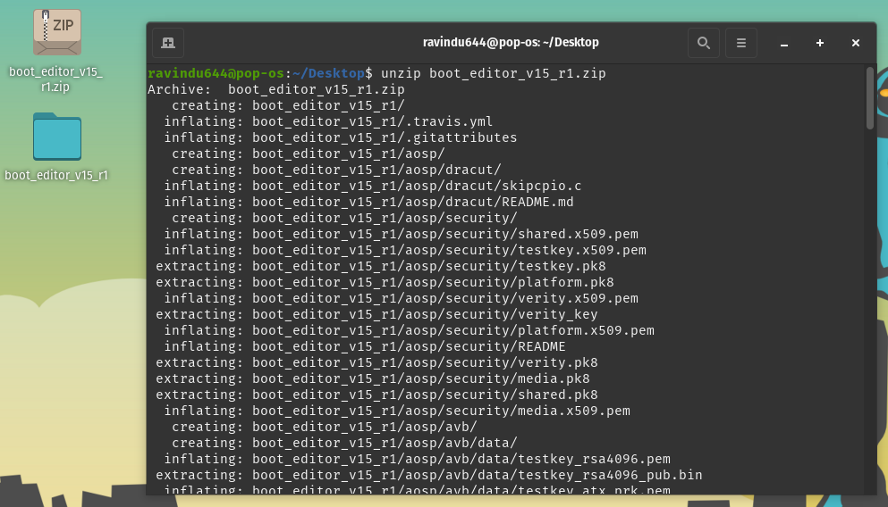

### 02. Getting `magiskboot` from the extracted folder & Adding it to the system PATH

- The `magiskboot` binary will be located inside the `extracted_magisk_apk/lib/<arch>` folder with the filename `libmagiskboot.so` :

  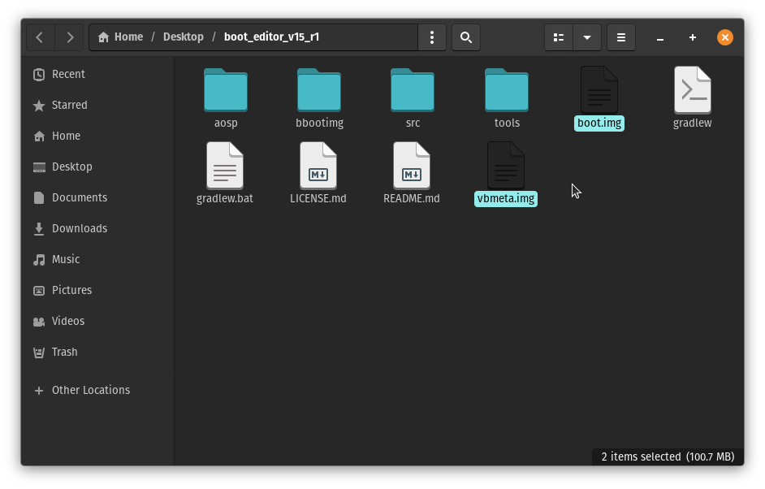

**Rename it to `magiskboot` and install it to your system PATH with this:**

  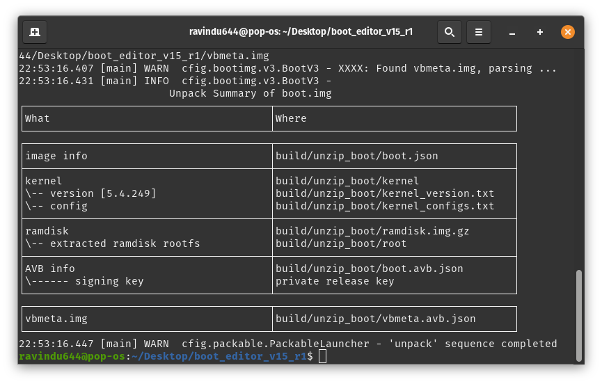

Quick commands:

```bash
# Renaming libmagiskboot.so to magiskboot
mv libmagiskboot.so magiskboot

# Giving magiskboot executable permissions
chmod +x magiskboot 

# Installing magiskboot to the system PATH
sudo cp magiskboot /usr/local/bin/
```

### 03. Unpacking the `boot.img`

1. Extract the `boot` image from your stock ROM and place it inside a new folder.

    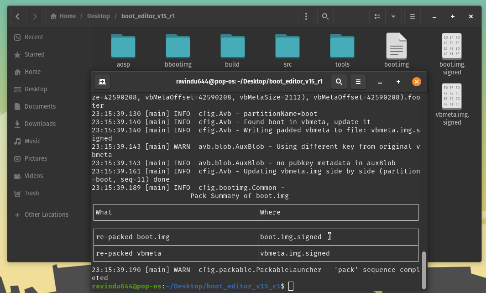

    **✔️ Samsung-only note:**

    - **On Samsung devices,** these images are usually located inside the `AP_XXXX.tar.md5` file.
    - Rename `AP_XXXX.tar.md5` to `AP_XXXX.tar` to remove the `md5` extension, extract `AP_XXXX.tar`, and grab the `boot.img.lz4` file from the extracted folder.
    - Then **decompress this lz4 file** with the command below, and you will get your RAW `boot.img`:

        ```bash
        lz4 boot.img.lz4
        ```

        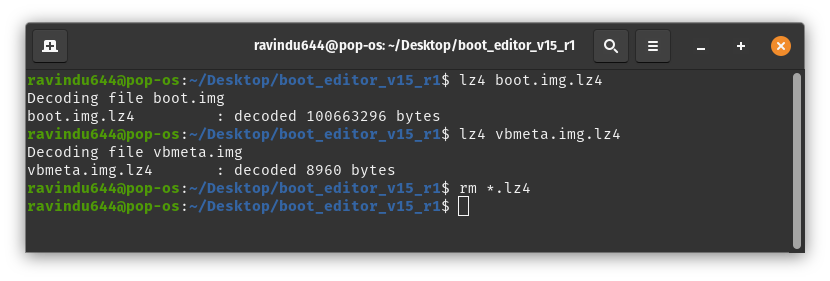

2. Now, run the following command to unpack the `boot.img`:

  ```bash
  magiskboot unpack boot.img
  ```

  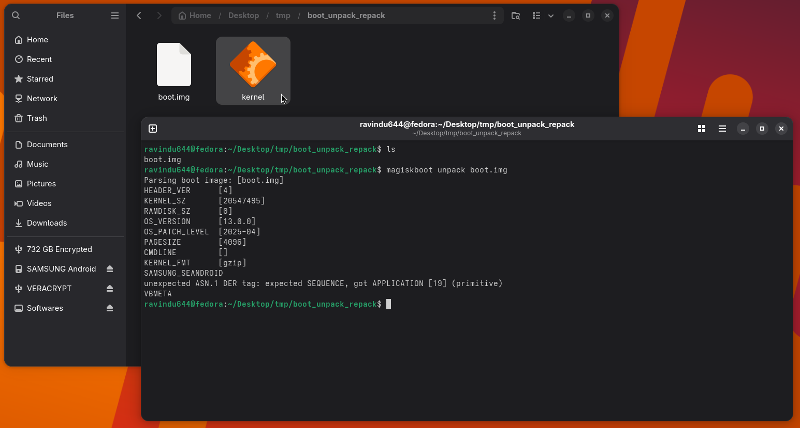

🟠 As you can see in the screenshot above, the original `kernel` of the unpacked `boot.img` is in the same folder as the boot.img.

**Note:** Don't delete the original boot.img as it is needed for the repacking process.

### 04. Repacking the `boot.img`

- Now, all we have to do is **replace the original `kernel` with our compiled custom kernel.**

**Example:**

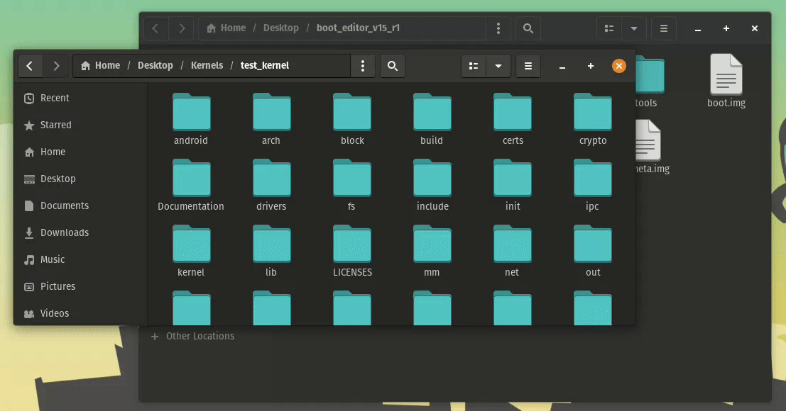
**What did I do?**

1. Copied the compiled `Image` from the `build` folder to the folder where we unpacked our `boot.img` using `magiskboot`

2. Deleted the original `kernel` and renamed `Image` to `kernel` 😎

3. Then repacked the `boot.img` using the below command:

```bash
magiskboot repack boot.img
```

  

🟨 Our new boot image lands in the same folder where we unpacked the stock `boot.img`, with the name `new-boot.img`.

- Copy the `new-boot.img` file to another location and rename it to `boot.img`

- Now, all you have to do is **flash that `boot.img` through fastboot mode** or **Download mode** (Samsung)

**✔️ Samsung-only note:**

- You can create an ODIN-flashable `tar` file using the command below:

  ```bash
  tar -cvf "Custom-Kernel.tar" boot.img
  ```

- Then, flash that `tar` file using ODIN's AP slot :)

---

**Written by:** [@ravindu644](https://t.me/ravindu) and our contributor(s)

**Join Telegram:** [@SamsungTweaks](https://t.me/SamsungTweaks)

---
