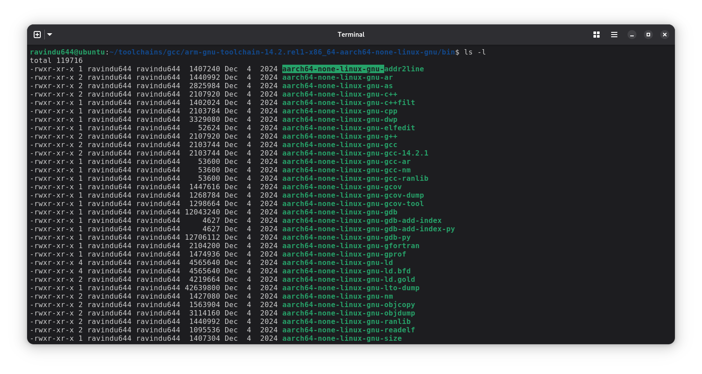

> [!CAUTION]
> **By using this guide, you accept all risks -** including potential device bricking, failed boots, or other issues. **We take no responsibility for any damage.**
> 
> Questions will **only** be considered **if you've read the full documentation** and **done your own research first.**

## A Beginner-Friendly Guide to Compile Your First Android Kernel!


[](#)
[](/LICENSE)
[](https://t.me/SamsungTweaks)

**What You'll Learn:**  

- Understanding the kernel root & choosing the right compilers for compilation
- Customizing the kernel and applying kernel patches.
- Remove Samsung's anti-root protections.  
- Creating a signed boot image from the compiled kernel

**Requirements:**
- A working 🧠  
- Patience  
- A Linux-based PC/Server (Debian-based recommended)  
- Basic knowledge of Linux commands and Bash scripting  
- Basic knowledge of version control (Git)  
  - This is good practice when building a kernel. Imagine you edit some files and realize you've messed up the source - this one single command `git stash` can help you revert all the uncommitted changes you made. How cool is that :)  

  - Go [learn some Git from here](./Git-for-beginners/) **before** you start learning kernel compilation!
	
### 🛠 Install required dependencies for compiling kernels

> [!TIP]
> For the most reliable and hassle-free experience, we recommend using our pre-configured Docker container which provides a stable, tested environment for kernel compilation that works on any OS. Download it from the [releases page](https://github.com/ravindu644/Android-Kernel-Tutorials/releases) and follow the included instructions.

<details>
<summary><strong>Expand to view how the Docker container looks like</strong></summary>


*Screenshot of the Ubuntu-based Docker container running on Fedora (click to view in full quality)*

</details>

But, if you don't want to use the Docker container, here are the commands to install the dependencies for Ubuntu/Fedora:

<details>
<summary><strong>🟧 Ubuntu/Debian-based distributions (Ubuntu, Linux Mint, Debian, etc.)</strong></summary>

```bash
sudo apt update && sudo apt install -y git device-tree-compiler lz4 xz-utils zlib1g-dev openjdk-17-jdk gcc g++ python3 python-is-python3 p7zip-full android-sdk-libsparse-utils erofs-utils \
default-jdk git gnupg flex bison gperf build-essential zip curl libc6-dev libncurses-dev libx11-dev libreadline-dev libgl1 libgl1-mesa-dev \
python3 make sudo gcc g++ bc grep tofrodos python3-markdown libxml2-utils xsltproc zlib1g-dev python-is-python3 libc6-dev libtinfo6 \
make repo cpio kmod openssl libelf-dev pahole libssl-dev libarchive-tools zstd rsync --fix-missing && wget http://security.ubuntu.com/ubuntu/pool/universe/n/ncurses/libtinfo5_6.3-2ubuntu0.1_amd64.deb && sudo dpkg -i libtinfo5_6.3-2ubuntu0.1_amd64.deb
```
</details>

<details>
<summary><strong>🟦 Fedora/Red Hat-based distributions (Fedora, CentOS, RHEL, etc.)</strong></summary>

```bash
sudo dnf group install "c-development" "development-tools" && \
sudo dnf install -y git dtc lz4 xz zlib-devel java-17-openjdk-devel python3 \
p7zip p7zip-plugins android-tools erofs-utils java-latest-openjdk-devel \
ncurses-devel libX11-devel readline-devel mesa-libGL-devel python3-markdown \
libxml2 libxslt dos2unix kmod openssl elfutils-libelf-devel dwarves \
openssl-devel libarchive zstd rsync
```
</details>

<br>

### Quick Links :
01. 📁 [Downloading the kernel source code for your device](https://github.com/ravindu644/Android-Kernel-Tutorials#--downloading-the-kernel-source-code-for-your-device)
02. 🧠 [Understanding the Kernel root](https://github.com/ravindu644/Android-Kernel-Tutorials?tab=readme-ov-file#-understanding-the-kernel-root)
03. 🧠 [Understanding non-GKI & GKI kernels](https://github.com/ravindu644/Android-Kernel-Tutorials#-understanding-non-gki--gki-kernels)
04. 👀 [Preparing for the Compilation](https://github.com/ravindu644/Android-Kernel-Tutorials#--preparing-for-the-compilation)
05. ⚙️ [Customizing the Kernel (Temporary Method)](https://github.com/ravindu644/Android-Kernel-Tutorials#-customizing-the-kernel-temporary-method)
06. ⚙️ [Customizing the Kernel (Permanent Method)](https://github.com/ravindu644/Android-Kernel-Tutorials#-customizing-the-kernel-permanent-method)
07. [⁉️ How to nuke Samsung's anti-root protections?](https://github.com/ravindu644/Android-Kernel-Tutorials#%EF%B8%8F-how-to-nuke-samsungs-anti-root-protections)
08. 🟢 [Additional Patches](https://github.com/ravindu644/Android-Kernel-Tutorials/tree/main#-additional-patches)
09. ✅ [Compiling the Kernel](https://github.com/ravindu644/Android-Kernel-Tutorials#-compiling-the-kernel)
10. 🟥 [Fixing the Known compiling issues](https://github.com/ravindu644/Android-Kernel-Tutorials#-fixing-the-known-compiling-issues)
11. 🟡 [Building a Signed Boot Image from the Compiled Kernel](https://github.com/ravindu644/Android-Kernel-Tutorials#-building-a-signed-boot-image-from-the-compiled-kernel)

---

> [!NOTE]
> If you are not a beginner and want to build a GKI 2.0 kernel from the official Google sources, jump to the [gki-2.0](https://github.com/ravindu644/Android-Kernel-Tutorials/tree/gki-2.0) branch.
>
> Credit to [@TheWildJames](https://github.com/TheWildJames) for the awesome tutorial!
>
> To-do:
>
> - Write a separate guide about using Samsung/Google's official GKI Build Systems (1.0 / 2.0+) to build an automated kernel with customization support.
>
> - Write a guide on wiring up and injecting the 500+ built Loadable Kernel Modules (.ko drivers) into `vendor_boot` and `vendor_dlkm` images, without causing conflicts or device crashes.

---

<h2> ✅ Downloading the kernel source code for your device</h2>

- **⚠️ If your device is Samsung,**

#### 01. Download the kernel source from here: [Samsung Opensource]( https://opensource.samsung.com/main)


#### 02. Extract the ```Kernel.tar.gz``` from the source zip, unarchive it using this command and please do not use any apps to do this:

```bash
tar -xvf Kernel.tar.gz && rm Kernel.tar.gz
```


**Note:** It's a good idea to give the entire kernel directory 755 permission to remove those read-only error from files and folders. This prevents issues when editing files and upstreaming the kernel.

**Run this command to fix it:**

```
chmod +755 -R /path/to/extracted/kernel/
```

**Before:**


**After:**


**The following video demonstrates all the steps mentioned above:** 

[🎥 Extracting Samsung's Kernel.tar.gz & granting required permissions](https://www.youtube.com/watch?v=QLymPkTpC2Y)

<hr>

- **⚠️ For other devices,** You can find them by your OEM's sites or from your OEM's **official** GitHub repos:

  

## ✅ Understanding `non-GKI` & `GKI kernels`

### 01. GKI project introduction

- **Generic Kernel Image,** or **GKI,** is an Android's project that aims for reducing kernel fragmentation, (and also improving Android stability), **by unifying kernel core and moving SoC and Board support out of the core kernel into loadable vendor modules.**

### 02. `pre-GKI`/`non-GKI` and `GKI` linux version table
| Pre-GKI | GKI 1.0 | GKI 2.0 |
|---------|---------|---------|
| 3.10    | 5.4     | 5.10    |
| 3.18    |         | 5.15    |
| 4.4     |         | 6.1     |
| 4.9     |         | 6.6     |
| 4.14    |         |         |
| 4.19    |         |         |
#### Explanation:

1. **pre-GKI or non-GKI**:
   - The oldest Android kernel branch, likely starts from Linux version 2.x.
   - These kernels are **device-specific** because its often heavily modified to accommodate SoCs and OEMs needs.
   - Starting to get deprecated in ACK, since `linux-4.19.y` branch already reaching EoL (End of Life) state, with last Linux 4.19.325

3. **GKI 1.0**:
   - Android's first generation of the Generic Kernel Image, starting with kernel version **5.4**.
   - This first generation of GKI only have android11-5.4 and android12-5.4 branch and Google announced that GKI 1.0 is deprecated.
   - The first generation of GKI is not yet matured as second generation of GKI, as its failed to reach GKI project goals.
   - These kernels are considered as **device-specific**, but more commonized, depends on how OEMs and SoCs Manufacturer treat them.
   - SoC Manufacturers often modify GKI 1.0 kernel to add their SoC features. From this modifications, the term **Mediatek GKI (mGKI)** and **Qualcomm GKI (qGKI)** exist.

4. **GKI 2.0**:
   - Android's second generation of the Generic Kernel Image, starting with kernel version **5.10**.
   - In this second generation, GKI project starting to get matured properly.
   - This kernel is considered as "universal", since you can boot a GKI kernels that builded with Google's GKI kernel source on **some** devices, if correct and match.

### Notes:
- **LTS = Long-Term Support**: These kernels are stable, well-maintained, and receive long-term updates.
- **GKI = Generic Kernel Image**: A unified kernel framework introduced by Google to standardize the kernel across Android devices.
- **SoC = System on Chip**
- **ACK = Android Common Kernel**: An Android's linux LTS kernel branch, modified to accommodate Android needs.
- OEMs like Samsung may still modify GKI 2.0 kernels to accommodate their needs, and can cause some issues like broken SD Card and broken Audio. 
  - **So, use their GKI kernel source instead if possible.**

- For 4.19 kernels, they are predominantly non-GKI implementations, as true GKI was not officially introduced until kernel 5.4 with Android 11.

  - OEMs typically use heavily customized, device-specific implementations based on the Android Common Kernel for 4.19. You can refer to the Android Common Kernel repository if you are interested.
  - For your information, there was experimental GKI development with 4.19 (android-4.19-gki-dev branch), but this was not widely deployed. Official GKI implementation began with kernel 5.4.
  - Examples:
     1. Most Samsung devices with kernel 4.19 use non-GKI implementations with OEM-specific modifications.
     2. True GKI adoption became standard with newer devices shipping Android 11+ with kernel 5.4 or higher.

## ✅ Understanding the ```Kernel root```


- As you can see in the above screenshot, it's the Linux kernel source code.
- It must have those folders, **highlighted in blue in the terminal.**
- **In traditional GKI kernels,** the kernel root is located in a folder named "common".

- **In GKI Samsung Qualcomm kernel sources**, you should use the `common` kernel instead of `msm-kernel` for compilation.
- **In some GKI Samsung MediaTek kernel sources**, the kernel root is named `kernel-VERSION.PATCHLEVEL`.
  - e.g., `kernel-5.15`

## ✅ Preparing for the Compilation

- There are 2 ways to compile the kernel.  

1. **Without** a build script.  
2. **With** a build script.  

If you are a beginner, I recommend trying to build the kernel without a build script first. Once you understand the logic, you can then use a build script to make your life easier :)

---

## 🟠 Method 1: Without a build script.

### 01. Choosing the right compiler.

- Before compiling the kernel, we must determine the compatible compilers to use for building our kernel.

- You can open your `Makefile` to check your kernel version.  

    
  *Kernel version = `VERSION.PATCHLEVEL.SUBLEVEL`*

- In my case, the kernel version is **4.14.113**.

- You can find full information about **choosing the correct compiler for your kernel version** [here](./toolchains/) (based on my experience, btw).

- In my case, they are: [clang-r383902b](https://github.com/ravindu644/Android-Kernel-Tutorials/releases/download/toolchains/clang-r383902b.tar.gz), [arm-gnu-toolchain-14.2.rel1-x86_64-aarch64-none-linux-gnu](https://github.com/ravindu644/Android-Kernel-Tutorials/releases/download/toolchains/arm-gnu-toolchain-14.2.rel1-x86_64-aarch64-none-linux-gnu.tar.xz)

- Download the correct compiler(s) for your kernel version from there, and extract them into a new folder(s) like this:

    
  *Extracted clang*

    
  *Extracted cross compiler*

---
### 02. Exporting the compiler locations to the PATH

- Even though we downloaded the right compilers, our system (Host OS) will not automatically know which compiler to use for building our kernel.  

- By default, it will use the system’s compilers, which might be incompatible with older kernels.  
  → In such a case, the build will fail instantly.  

- So, our task is to wire up the downloaded compilers to our system’s `PATH`.  
  We must tell the system: “use the `clang` binary from here, not your own clang!”  

---

#### 💡 What is `PATH`?
`PATH` is an environment variable in Linux/Unix that stores a list of directories.  
When you type a command (like `clang` or `gcc`), the system looks through the directories in `PATH` **from left to right** to find the first matching executable.  

By adding your downloaded compiler’s folder to **the begining of the** `PATH`, you make sure the build system picks **your compiler** instead of the system default.

---

- To check what your `PATH` variable looks like, you can type `echo $PATH` in the terminal:  

    
  - Our goal is to add our compilers' locations to the left side of `/usr/local/sbin` :)

- In the extracted compiler folders, the binary files (executables) are usually located inside the `bin` folder, like this:  

  

- Copy the full path to that `bin` folder and export those locations to the `PATH` like this:  

  ```bash
  export PATH="/path/to/first/compiler/bin:/path/to/second/compiler/bin:$PATH"
  ```

- **In my case,** it looked like this:

  ```bash
  export PATH="/home/kernel-builder/toolchains/clang-r383902b/bin:/home/kernel-builder/toolchains/gcc/arm-gnu-toolchain-14.2.rel1-x86_64-aarch64-none-linux-gnu/bin:$PATH"
  ```

**As you can see, we have successfully exported the toolchains to our `PATH`:**

  

**For confirmation,** type `clang -v` in the terminal to verify that it is actually wired up!

  
  *We did it!*

---

### 03. Compiling the kernel with `make`

- Keep in mind that the `PATH` variable we exported in Step 02 is **only valid in the currently opened terminal.**  

  **So, don't close it** - use that terminal window to navigate the kernel source and run commands for further compilation.

- **Now,** using that terminal window, navigate to your **root of the kernel source** like this: `cd /path/to/kernel-root`

  

---

**💡 Better to Know:** A **defconfig** (default configuration) is like a preset settings file for the kernel.

- It tells the build system which features to enable or disable.
- Common defconfig locations are `arch/arm64/configs` or `arch/arm64/configs/vendor`.

---

- **In my case,** my defconfig is located at `arch/arm64/configs`, and its name is `exynos9820-beyondxks_defconfig`.

  - **Also,** I have multiple defconfigs made for my **specific purposes**, named: `common.config`, `ksu.config`, and `nethunter.config`.
  - You can also create your own customized defconfigs for specific changes (more on that later)!

- Now, we need to tell our compilers to "use these defconfigs to build the kernel"!  
- To do that, simply run the following command:

```bash
make \
  ARCH=arm64 \
  CC=clang \
  CROSS_COMPILE=aarch64-none-linux-gnu- \
  CLANG_TRIPLE=aarch64-none-linux-gnu- \
  your_defconfig your_second_defconfig your_third_defconfig
```
---

**💡 Explanation:**

1. **ARCH=arm64** → Specifies the architecture of the kernel we are building.

    - In our case, it is 64-bit ARM.

2. **CC=clang** → Tells `make` to use the `clang` compiler.

    - **Don't change this value.** Keep it as it is!

3. **CROSS_COMPILE=aarch64-none-linux-gnu-** → Prefix for the cross-compiler binaries (e.g., `aarch64-none-linux-gnu-gcc`).

    - You can get this value by opening your GCC's `bin` folder. All the binaries have the same prefix!

      
    *See the highlighted part. `aarch64-none-linux-gnu-` is the common prefix for all the binaries, and it is the value for the `CROSS_COMPILE` variable.*

4. **CLANG_TRIPLE=aarch64-linux-gnu-** → Tells Clang exactly which target architecture, OS, and ABI to compile for.

    - Ensures the kernel build system can enable features and flags specific to ARM64 Linux.
    - This does **not** require a literal binary named `aarch64-linux-gnu-` in your path — Clang uses it internally as a target specification.
    - You can also use `aarch64-none-linux-gnu-` as the triple; the vendor field (`none`) is usually ignored by Clang.

5. **your_defconfig ...** → These are the configuration files (`defconfigs`) that define which kernel features, drivers, and options to include in the build.

**This is the absolute barebone of the `make` command for compiling the Android kernel. Don't try to remove any part of this code!**

---

- Now, when you run that above command, the build system will read all of your `defconfig` files and merge them into a single file called `.config` !

  
  *Screenshot **before** running the command*

  
  *Screenshot **after** running the command*

**This will write the final configuration to a hidden file named `.config`, which will be used by the build system to compile the kernel:**

  

---

- Before compiling the kernel, if you want to edit the contents of the `.config` in a GUI way, you can use the `menuconfig` tool.  

- To launch `menuconfig`, type the same beginning of the command you used to create the `.config` (i.e., the `CC` and `CROSS_COMPILE` parts), but at the end, instead of defconfig names, use `menuconfig` like this:

```bash
make \
  ARCH=arm64 \
  CC=clang \
  CROSS_COMPILE=aarch64-none-linux-gnu- \
  CLANG_TRIPLE=aarch64-none-linux-gnu- \
  menuconfig
```

    
  *It will open something like this. Feel free to edit it according to your needs.*

**Use the arrow keys to navigate through `menuconfig`. Once you are done editing, exit `menuconfig` to proceed with building the kernel.**

**Note:** The customization part is not discussed here; it is covered in Method 2. This is just the barebones of "Compiling the kernel."

---

- Now, we have successfully created the final configuration file (`.config`) and, if needed, customized it using `menuconfig`.  

- The only thing left to do is compile the kernel!  

- To compile, run the same command as before with the same beginning (the `ARCH`, `CC`, and `CROSS_COMPILE` parts), but this time **do not specify any defconfig or menuconfig at the end**. Like this:

```bash
make \
  ARCH=arm64 \
  CC=clang \
  CROSS_COMPILE=aarch64-none-linux-gnu- \
  CLANG_TRIPLE=aarch64-none-linux-gnu-
```

---

### 💡 What this does:

This command tells the build system to start compiling the kernel immediately using the `.config` you just created. All the settings and options from `.config` will now guide the build process.

---

**Once you run the above command, the build system will start compiling the kernel in the same kernel root directory:**

    

### Barebone Training is enough! 

**Let's jump into the easiest and laziest method you can do xD**
**We'll explore the compilation more deeply in `Method 02`!**

---

## 🟠 Method 2: With a build script.

### 01. After downloading or cloning the Kernel Source, we should have a build script to compile our kernel.

- Before creating a build script, we must determine the compatible compilers we will use to build our kernel.

- Run ```make kernelversion``` inside the kernel root to check your kernel version.


- In my case, the kernel version is **5.4,** with qualcomm chipset, which is [qGKI](https://github.com/ravindu644/Android-Kernel-Tutorials#-understanding-non-gki--gki-kernels).

- You can find full information about **choosing the correct compiler for your kernel version** [here](./toolchains/) (based on my experience, btw).

- Keep in mind that **you don't need to manually download any of these toolchains** since my build scripts handle everything for you :)  

- Next, go to [build_scripts](./build_scripts/), choose the appropriate script, download it, and place it inside your kernel's root directory.


<hr>

> [!CAUTION]
>
> These GKI build scripts only compile the kernel `Image` from source. They **may NOT include**:
> - OEM out-of-tree drivers (e.g., Samsung's `sec_*`, EFUSE triggers, TrustZone handlers)
> - Vendor-specific modules built only via official OEM build systems.
>
> Flashing this `Image` as your **first custom binary** after unlocking the bootloader can **permanently hard brick** your device — especially on **Samsung MediaTek GKI 2.0+** models.
>
> Why? Because missing security drivers may prevent proper EFUSE handling, and the system may treat your flash as a tamper violation, leading to irreversible brick.
>
> I’ve already bricked a phone this way — so **take this seriously.**
>
> If you still want to proceed and learn how to build a *safe* and *bootable* GKI kernel, especially for Samsung MTK devices, refer to my **SM-A166P repo**:
>
> 👉 https://github.com/ravindu644/android_kernel_a166p
>
> **TLDR:** **DO NOT FLASH GKI `Image` ALONE WITHOUT VENDOR DRIVERS — ESPECIALLY ON SAMSUNG MTK DEVICES**

<hr>

### 02. Edit the Build script:

**Open the build script in a text editor and make these changes:**

- Replace `your_defconfig` to your current defconfig which is located in `arch/arm64/configs`

- In GKI 2.0 kernels, it's normally `gki_defconfig`

- But just in case, make sure to check `arch/arm64/configs` or `arch/arm64/configs/vendor`

- If your defconfig is located in the `arch/arm64/configs` directory, just replace `your_defconfig` with the name of your defconfig.

- If your defconfig is located in the `arch/arm64/configs/vendor` directory, replace `your_defconfig` like this:
  
  - `vendor/name_of_the_defconfig`
  - Example patch: [here](./patches/005.edit-defconfig.patch)

  

**❗If your device is Samsung Exynos, it doesn't support compiling the kernel in a separated 'out' directory. So, [edit your build script like this](./patches/001.nuke_out.patch)**  

---
#### ⚠️ [IMPORTANT] : *If your device is Samsung, it usually uses some device-specific variables in "some" kernels.*

- **As an example,** in the Galaxy S23 FE kernel source code, we can see they used variables called `TARGET_SOC=s5e9925`, `PLATFORM_VERSION=12`, and `ANDROID_MAJOR_VERSION=s`

- **If we didn't export those variables correctly,** the kernel failed to build in my case.

- Don't worry, they usually mention these required variables in their `README_Kernel.txt` or their own `build_kernel.sh`

  

**Refer to this example patch to properly integrate such variables into our build script:** [here](./patches/007.Define-OEM-Variables.patch)

**Note:** Just don't overthink it, even if they use values like 12 and S for Platform and Android versions, even if you have a higher Android version.

---

🔴 **If your device has a MediaTek chipset, usually it doesn't support booting a RAW kernel `Image`. Therefore, you should build a gzip-compressed kernel `Image.gz` instead.**  

- [Here's the required patch for it](./patches/014.build_gzip_compressed_kernel.patch)

---

### 03. Edit the Makefile.

- If you find these variables: ```REAL_CC``` or ```CFP_CC``` in your "Makefile", remove them from the "Makefile", then Search for "wrapper" in your Makefile. If there's a line related to a Python file, remove that entire line/function as well.

    - Example patch of removing the wrapper: [click here](./patches/004.remove_gcc%20wrapper.patch)

<hr>

### 04. Now, grant executable permissions to ```build_xxxx.sh``` using this command.
  ```
  chmod +x build_xxxx.sh
  ```
### 05. Finally, run the build script using this command :
  ```
./build_xxxx.sh
```


- When you run the script for the first time, it will begin to install all the necessary dependencies and start downloading the required toolchains, depending on your kernel version.

- Make sure not to interrupt the first run. If it gets interrupted somehow, delete the `toolchains` folder from "~/" and try again: ```rm -rf ~/toolchains```


### After the initial run is completed, the kernel should start building, 


### and the "menuconfig" should appear.


- **Additional notes:**
    - You can completely ignore anything displayed as `warning:`
      - Eg: `warning: ignoring unsupported character '`
<hr>

## ✅ Customizing the Kernel (Temporary Method)
- Once the *menuconfig* appears, you can navigate through it and customize the Kernel in a graphical way as needed.

- **As an example,** we can customize **the Kernel name, enable new drivers, enable new file systems, disable security features,** and more :)

#### You can navigate the *menuconfig* using the arrow keys (← → ↑ ↓) on your keyboard and press `y` to enable, `n` to disable or `m` to enable as a module `<M>`.

### 1. Changing the Kernel name.

- I guess no explanation is needed for this:

    

- Located in: `General setup  ---> Local version - append to kernel release`


### 2. Enabling BTRFS support.

- Btrfs is a modern Linux filesystem with copy-on-write, snapshots, and built-in RAID, ideal for reliability and scalability.

- Located in: `File systems  ---> < > Btrfs filesystem support`


### 3. Enabling more CPU Governors

- **CPU governors control how the processor adjusts it's speed.**
-  You can choose between performance-focused governors (like "performance" for max speed) or battery-saving ones (like "powersave").
-  Please note that this may impact your SoC’s lifespan if the device overheats while handling performance-intensive tasks.

**Enabling more CPU Governors:**

- Located in: `CPU Power Management  ---> CPU Frequency scaling  ---> `


**Changing the Default CPU Governor:**

- Located in: `CPU Power Management  ---> CPU Frequency scaling  ---> Default CPUFreq governor (performance)  --->`


### 4. Enabling more IO Schedulers

- **IO schedulers control how your system handles reading and writing data to storage.**
- Different schedulers can make your system faster or help it run smoother, depending on what you're doing (like gaming, browsing, or saving battery).
- Located in: `IO Schedulers  --->`


### The problem with menuconfig is that you have to do this every time you run the build script.

- All the changes you've made using menuconfig are saved in a temporary hidden file called `.config` inside the `out` directory.

  

- and it resets every time you run the build script.

  

- So, we need a permanent method to save our changes, right?  

## ✅ Customizing the Kernel (Permanent Method)

- In this method, **we are going to create a separate `custom.config` to store our changes** and **link it to our build script.** 

- After that, when we run the build script, **it will first use your OEM defconfig to generate the `.config` file, then merge the changes from our `custom.config` into `.config` again.** 

**Refer to these examples to get a basic idea:** [patch](./patches/008.add-custom-defconfig-support.patch), [commit](https://github.com/ravindu644/android_kernel_m145f_common/commit/c427dbebed22c5bb314b4c94c711deffe671b14c)

---

### 🤓 How to add changes to our `custom.config` ?

- First, We have to find the exact **kernel configuration option** you want to **enable** or **disable**.

- Example **kernel configuration option**: `CONFIG_XXXX=y`

  - `CONFIG_XXXX`: The name of the kernel option or feature **( Must begin with `CONFIG_` )**
  - `=y`: This means "yes" -> the option is enabled and will be included in the kernel.
  - `=n`: This means "no" -> the option is disabled.

- You can find the name of the **kernel configuration option** this way:

  - Run the build script and wait until `menuconfig` appears.
  - Navigate to the option/feature you want to enable.
  - Press `shift + ?` on your keyboard, and an explanation about the option/feature will appear.
  - You’ll see the name of the **kernel configuration option** in the top-left corner of the menuconfig.

    

  - **Copy that name** and add it to your `custom.config` with `=y` or `=n` to enable or disable it.

    

## ⁉️ How to nuke Samsung's anti-root protections?

 - ### [Moved to here](./samsung-rkp/)

## 🟢 Additional Patches

### 01. To fix broken system funcitons like Wi-Fi, touch, sound etc.
> [!NOTE]
> Bypassing this usually not a good practice, because something like this is used as **last effort,**
>
> when there's no open source linux driver found. (e.g Proprietary drivers)
>
> But, for newbies or kernel developer that wanna ship their Loadable Kernel Module, **this is okay.**

---

  - On some devices, **compiling a custom kernel can break system-level functionalities like Wi-Fi, touch, sound, and even cause the system to not boot.**

  - The reason behind this is that the device can't load the external kernel modules `(*.ko)`, due to linux's prebuilt security feature `(symversioning, signature)` that prevent malicious kernel module to load.

  - To fix this issue, [use this patch](./patches/010.Disable-CRC-Checks.patch) to force the kernel to load those modules.

  **Even if you don't have such an issue, using this patch is still a good practice.**

  ---

### 02. Fix: `There's an internal problem with your device.` issue.

**The reason:**

  ```
Userspace reads /proc/config.gz and spits out an error message after boot
finishes when it doesn't like the kernel's configuration. In order to
preserve our freedom to customize the kernel however we'd like, show
userspace the stock defconfig so that it never complains about our
kernel configuration.
  ```

- To fix this issue, make a copy of your OEM's Defconfig and rename it to `stock_defconfig`.

  

- Then, use the patch below to fool Android into thinking that the defconfig was not changed:

  - [Patch](./patches/011.stock_defconfig.patch), [Commit](https://github.com/ravindu644/android_kernel_a047f_eur/commit/d306bd4c4c84a12be5235e31540f40fb9c1a1066)
    
## ✅ Compiling the Kernel

- Once you've customized the kernel as you want, simply **exit menuconfig**.  
- After exiting, the kernel will start compiling!


### 💡 If everything goes smoothly like this,

  

### you’ll find the built kernel `Image` inside the `build` folder in your kernel root!

  

## 🟥 Fixing the Known compiling issues

- **If you ever encounter any errors during your kernel compilation,** jump to [fixes](./patches/) and see if your specific issue is mentioned there.

**[Click here to learn about known issues and their fixes](./patches/README.md)**

## 🟡 Building a Signed Boot Image from the Compiled Kernel

- On Android devices, **the `kernel` image is usually located inside the `boot` partition.**

  

- So, all we have to do is **get the boot image from the stock ROM, unpack it, replace its kernel with our "built" one, repack it, flash it,** and **enjoy :)**

**For the unpacking and repacking process, we are going to use [Android_boot_image_editor](https://github.com/cfig/Android_boot_image_editor) by [@cfig](https://github.com/cfig) :)**

### 01. Downloading `Android_boot_image_editor`

- Download the latest release zip from [here](https://github.com/cfig/Android_boot_image_editor/releases/latest) and unzip it like this:

  

**Note:** Make sure to follow the [requirements installation section](https://github.com/ravindu644/Android-Kernel-Tutorials#-install-the-dependencies-for-compiling-kernels) before using the [Android_boot_image_editor](https://github.com/cfig/Android_boot_image_editor)

### 02. Unpacking the `boot.img`

1. Extract both the `boot` and `vbmeta` images from your stock ROM and place them inside the `boot_editor_vXX_XX` folder

  

**✔️ Samsung-only note:**

  - **On Samsung devices,** these images are usually located inside the `AP_XXXX.tar.md5` file.

  - All you have to do is rename `AP_XXXX.tar.md5` to `AP_XXXX.tar` to remove the `md5` extension, extract `AP_XXXX.tar`, and grab the `boot.img.lz4` and `vbmeta.img.lz4` files from the extracted folder.

  - Then, **decompress these lz4 files using the following commands,** and you will get your `boot.img` and `vbmeta.img`

    ```bash
    lz4 boot.img.lz4
    lz4 vbmeta.img.lz4
    ```  
    
    

2. Now, run following command to unpack the `boot.img` :

- **Keep in mind,** this will take some time on the first run since the tool downloads dependencies during its initial execution.


  ```bash
  ./gradlew unpack
  ```

  

#### 🟠 As you can see in the screenshot above, the original `kernel` of the unpacked `boot.img` is located in `build/unzip_boot/kernel`

### 03. Repacking the `boot.img`

- Now, all we have to do is **replacing the original `kernel` located inside the `boot_editor_vXX_XX/build/unzip_boot` with our custom kernel.**

**Example:**


<br><br>

**What did I do?**

1. Copied the compiled `Image` from the `build` folder of the Kernel Root to `boot_editor_vXX_XX/build/unzip_boot`

2. Deleted the original `kernel` and renamed `Image` to `kernel` 😎

#### 🟢 Now, run the command below to cook our new `boot.img`, which contains our custom kernel :)

  ```bash
  ./gradlew pack
  ```

  

### 🟨 Our new boot image will be located inside the `boot_editor_v15_r1` folder with the name `boot.img.signed`

- Copy the `boot.img.signed` file to another location and rename it to `boot.img`

- Now, all you have to do is **flash that `boot.img` through fastboot mode** or **Download mode** (Samsung)

**✔️ Samsung-only note:**  

- You can create an ODIN-flashable `tar` file using the command below:  

  ```bash
  tar -cvf "Custom-Kernel.tar" boot.img
  ```

- Then, flash that `tar` file using ODIN's AP slot :)

---

**Written by:** [@ravindu644](https://t.me/ravindu) and our contributor(s)

**Join Telegram:** [@SamsungTweaks](https://t.me/SamsungTweaks)

---
