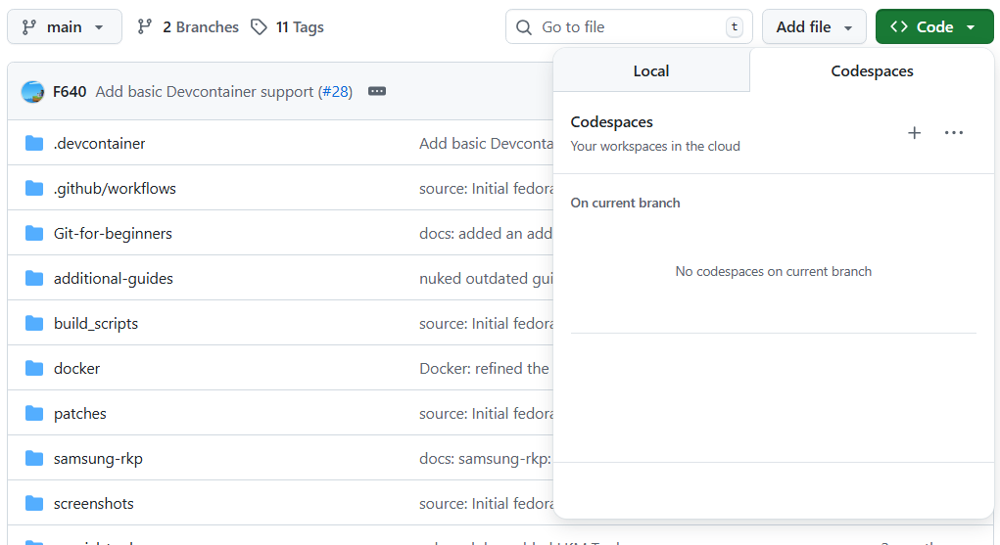
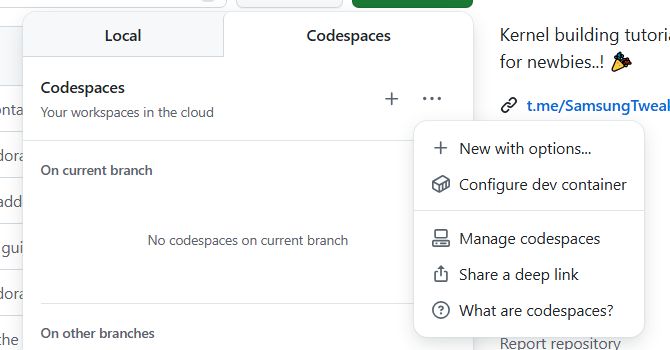
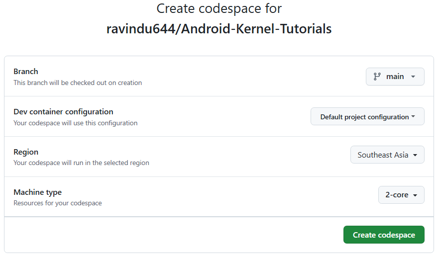
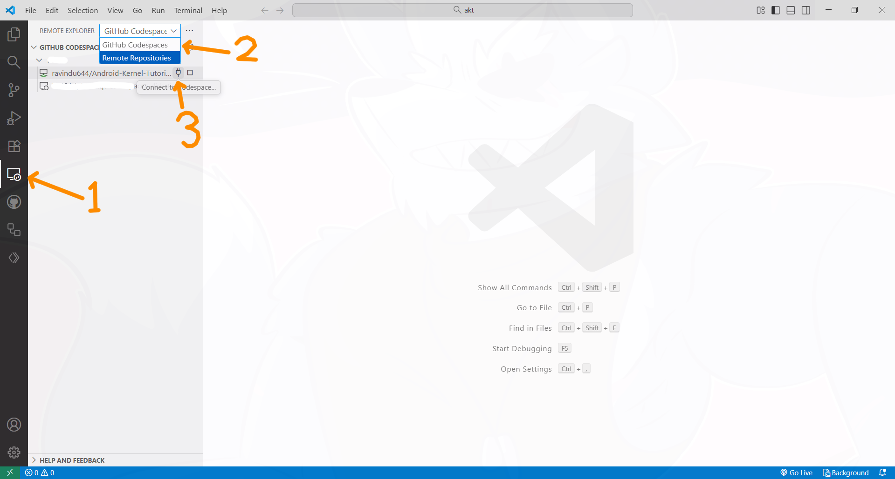
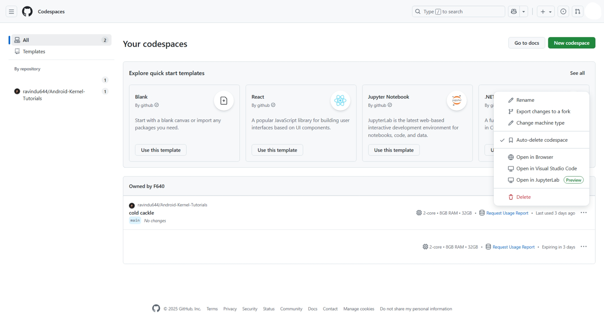

# Basics of operating Visual Studio Code Web on Developer Container

> [!NOTE]
> VSCode = Visual Studio Code

## Intro

This guide is still rough

**Requirements**

Very similar to building kernel guide, but you will also need:

- [A supported web browser](https://code.visualstudio.com/docs/setup/vscode-web#_browser-support) if you use it to interact with VSCode Web

However you will no longer need to own Linux-based computer since you will use GitHub's server as the Linux host, but i also recommend you to use a computer since VSCode Web relies on mouse and keyboard for usability reasons.

This guide focuses usage on GitHub Codespaces, but feel free to adapt it to other IDE services that uses dev container as its environment and VSCode as its IDE like Devpod or running dev container locally.

## Creating new Codespace container from this repo

1. Click `code` button then go to `codespaces tab`

2. The kernel builder codespace does not use default dev container path, so now open menu button then click `New with options` button

3. Once options displayed, adjust settings according your needs, after adjusting click `Create Codespace` button now

> [!IMPORTANT]
> Pick configuration according your needs. If you need full configuration pick `Kernel Builder Full` configuration, but if you need minimal configuration pick `Kernel Builder Minimal` configuration.

> [!WARNING]
> GitHub counts your core time per core, so if you have selected 2 CPUs you will have half total core time, 4 will be a quarter of total core time!

> [!WARNING]
> GitHub Codespaces has **usage limits**, espesially if you do not use their pay-as-you-go scheme (Free and GH pro user) or has this feature limited. If you often use this feature please monitor your usage!
>
> If you hit your usage limits, your instance will be stopped immediately and cannot use it anymore until next billing period!
> More information and usage limits [here](https://docs.github.com/en/billing/concepts/product-billing/github-codespaces)

> [!TIP]
> Usually the closer the region is towards your area you will experience less delays. You can notice delays in terminal

## VSCode web workspace walkthrough

Once codespace setup completed, you will be greeted with this screen below:

> [!IMPORTANT]
> We will only go through important features for building kernel. If you need to learn more about VSCode like editing files please check [their docs](https://code.visualstudio.com/docs) or watch any YouTube guides

> [!TIP]
> If you want to quickly open a repo without GitHub Codespaces you can open any GitHub repositories, then replace github.com with github.dev. This way you can learn how to use VSCode web without any limits although it is very limited compared to GitHub Codespaces.

There are some key features that you will need to know:

- Navigating files through explorer pane

  Look at this image:
  
  1. Explorer pane
  2. folder (click to expand/unexpand)
  3. file (click to open)
  > [!TIP]
  > Tired seeing opened files replace by files you want to open? drag file to tab pane beetween tab items or empty tab pane zone to open in new tab
  4. Tab pane
  5. Tab item (click to switch or click X to close)

- Using terminal

  Look at this image:
  
  1. New terminal button
  2. Kill (or close) terminal button
  3. Fill terminal screen to above

  > [!IMPORTANT]
  > If you have multiple open terminals all terminals will be listed at right side in terminal pane (orange box). Hover to your desired terminal to show kill option

  4. Tab pane
  5. Tab item (click to switch or click X to close)

  > [!TIP]
  > type `code path/to/file-name` in terminal to open files quickly in VSCode

NOTE: if you accidentally closed terminal, open menu (top left hamburger menu), then click view, then click terminal

- Uploading files

  1. Click on any empty part in explorer pane to add file to root directory or click folder then right click on the folder
  2. Click "Upload..." button
  3. Pick files you want to upload

- Downloading files
  1. Right click any files or folders you want to download
  2. Click "Download..."

  > [!IMPORTANT]
  > If you are attempting to download folders, big files and multiple files, you will be prompted to pick a folder. If that is the case, make a new folder for VSCode to to download files since it can access everything inside folder you pick

  > [!TIP]
  > To download multiple files quickly, click files while holding ctrl (command button on MacOS) button. After all files picked do right click then click download as usual

- Stopping codespace from VSCode web
  
  Look at this image:
  
  1. Open command pane (that big box with search icon at center top)
  2. type command to stop current codespace: "> Codespaces: Stop Current Codespace"

  > [!IMPORTANT]
  > It is recommended to do this after using Codespace to preserve your usage time for future use

### Using GitHub Codespaces in VSCode desktop app

> [!IMPORTANT]
> I assume you are pretty familiar with VSCode, particularly about adding and setting up new extension

**requirements**

Have GitHub Codespaces extension installed (extension ID: `github.codespaces`) and signed in to user with access to your codespace.

- To switch from VSCode web to desktop app:
  1. Open menu at top left
  2. Click "Open in VS Code Desktop" button, then VSCode should launch soon
  3. Wait for it to connect
  4. Once done continue your work

- Launch Codespace from desktop directly

  Look at this image:
  
  1. Switch to "Remote Explorer"
  2. Switch Remote Explorer dropdown to "GitHub Codespaces"
  3. Pick your desired Codespace and press plug button (3rd arrow) to connect to Codespace. To stop it press stop button beside connect button

## Managing GitHub Codespaces

From here you can do various things to manage your codespaces like starting and stopping codespace, deleting codespace, change its settings like machine type, etc.